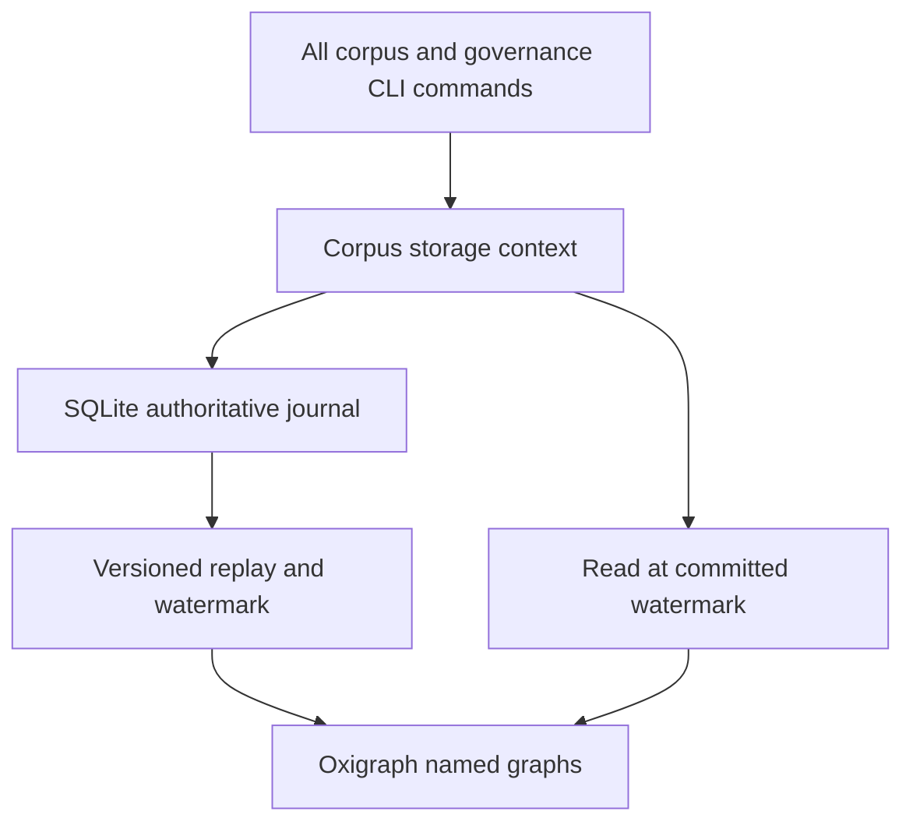
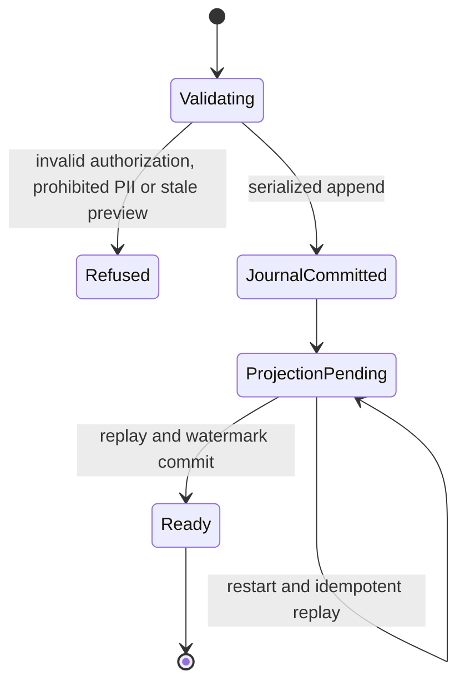

# Phase 13 Persistent Storage - Plan

## Goal Capsule

- Objective: Governance roles, shards and revision history survive process restarts, and a saved retraction preview can be applied safely in a later process.
- Authority: Damien's 2026-09-30 answer authorizes this plan after the [confirmed R18 record](../reviews/2026-09-30-r18-disposition.md); migration-plan U6 owns candidate lineage.
- Execution profile: Planning delivered in U12. Implementation follows separately dispatched U17 envelope work and the canary in U1; no production migration or deployment is authorized by this plan alone.
- Stop conditions: Unsupported schema, failed signature preservation, missing verified snapshot, or failed benchmark blocks the dependent unit.
- Delivery: Integrate this plan with the migration branch. The orchestrator owns implementation dispatch and default-branch integration.

## Product Contract

### Summary

Persist the existing shard and governance interfaces, then wire every CLI caller to one corpus-scoped context. Keep the current authorization and revision invariants while replacing process-local state.

### Problem Frame

`revision/store.py` has only in-memory get/put. Governance CLI commands use a process-local log, and `retract --apply` deliberately raises `NotImplementedError`. Retraction also enumerates `store._d`, so a backend swap alone silently loses the dependency graph.

### Key Decisions

- Storage follows R18 and precedes governance (session-settled: user-directed — chosen over parallel governance implementation: Damien's dated backlog answer fixes the order). Governs R1, R7.
- R18 is adopted as drafted, including revisable vocabulary and identity-only freezing (session-settled: user-directed — chosen over the old PRD envelope as storage authority: the shared model owns the boundary). Governs R1.

### Requirements

**Persistence and integrity**

- R1. Persist the R18-compatible, versioned envelope after U17; preserve original identity, null semantics and signature provenance through migration.
- R2. Shards, revisions, ordered governance events and active roles survive reopening and separate CLI processes with corpus isolation.
- R3. Governance remains append-only and preserves signature verification, genesis handling, authorization, last-admin refusal and monotonic positions under competing writers.
- R4. Saved preview application detects intervening shard or governance changes and commits at most once; denied or stale requests leave authoritative storage unchanged.

**Query, interoperability and operations**

- R5. Preserve named-graph isolation, the Phase 13 eight-format export contract, Gate-2 latency, bulk-load throughput, nightly TTL dumps with local Git commits and snapshot/dump restore requirements.
- R6. Keep existing validation on writes and reject raw-text inputs matching configurable PII patterns (default SSN, ABA and phone patterns) before journal append on shard creation, revision and bulk ingest. Expose the Phase 11 full-SHACL seam explicitly; never report that deferred exit criterion as passed.
- R7. Proposed-class governance implementation begins only after this storage work passes its exit criteria.

### Scope Boundaries

Phase 13 storage is covered; Phases 9–12, 13.5 and 14–20 retain their gates. Production source material and historical book fixtures are excluded. Private-corpus access policy remains Phase 13.5; new persistent artifacts must not expand the existing served-directory boundary.

## Planning Contract

### Key Technical Decisions

- KTD1. Use the existing pinned `pyoxigraph==0.5.7` for queryable RDF and existing `aiosqlite` for the append-only governance/revision journal. The `aiosqlite` comment in `governance/log.py` and the Oxigraph shard seam describe different responsibilities, not mutually exclusive backends. Governs R2, R3, R5.
- KTD2. Make the SQLite journal the authoritative commit record for shard payload/revision changes and governance events; make Oxigraph a replayable projection with a durable applied-position watermark. Never claim atomic commits across two databases. Readers catch up to the committed watermark before returning state; failure closes the context rather than serving a mixed revision. Governs R2–R4.
- KTD3. Serialize writes per corpus through the authoritative transaction. Allocate unique `(corpus, position)` there, verify permissions and preview freshness against that transaction's state, and use a unique operation ID for replay protection. Add UPDATE/DELETE refusal triggers on immutable journal rows. Governs R3, R4.
- KTD4. Extend `ShardStore` with typed corpus-scoped iteration/dependency access and remove `_d` inspection in `governance/retract.py`. Persistent implementations live in a new `storage/` package, outside pure-model dependency boundaries. Governs R2, R4.
- KTD5. Preserve source model versions and signed bytes in the journal. Derived RDF can change through versioned adapters, but transformed content never inherits an old signature. Back up and restore the journal plus projection watermark together; rebuild the projection when needed. Governs R1, R5.
- KTD6. Run ingest PII validation before immutable journal persistence; reject prohibited payloads without altering signed bytes or retaining rejected input in dumps. Keep rdflib adapter-only for validation and serialization, with no authoritative or projection write path through rdflib. Governs R1, R5, R6.

### High-Level Technical Design

Directional component and recovery design:

A committed journal operation whose projection update fails is pending recovery, not an aborted operation. Retrying its ID returns the same operation after recovery. Query/export refuses while recovery cannot finish.

### Risks and Dependencies

U17 is not a no-op: R18 adopts shared-model composites and identity boundaries instead of freezing the old subtype vocabulary. Its separately scoped implementation must compare `shards/envelope.py`, `shards/subtypes.py`, `revision/content_edit.py`, minting/IRI registry, RDF and canonical hash/signature adapters. Preserve IDs and original signed payloads; migrate versioned records explicitly and reject unsupported versions. This plan sizes that prerequisite without implementing the ON SHEET U17 card.

External research is excluded by the network-free lane. Before implementation, verify transaction, backup and replay APIs against the installed pinned packages and their official documentation; API assumptions are not tested by this planning artifact.

## Implementation Units

### U1. Establish schema and benchmark prerequisites

- Goal: Prove that U17's versioned adapters and the current stack support storage.
- Requirements: R1, R5. Dependencies: separately dispatched U17 completed.
- Files: `tests/shards/`, `tests/revision/`, `tests/bench/test_gate1_rdf12.py`, `tests/bench/test_gate2_sparql.py`.
- Approach: Capture synthetic round trips, canonical hashes and original signatures; rerun Gate 2 before backend work.
- Test scenarios: Legacy/current records preserve IDs and explicit nulls; unsupported versions fail; changed signed content fails old-signature verification. Gate-2 warm P95 is below 500 ms; the historical 800 ms ceiling is diagnostic, not a substitute pass.

### U2. Implement durable journal and RDF projection

- Goal: Reopen a corpus without losing shard, revision or governance state.
- Requirements: R1–R3, R5, R6. Dependencies: U1. Decisions: KTD1–KTD6.
- Files: new `src/folio_insights/storage/{context,governance,shards}.py`, `revision/store.py`, `governance/log.py`, new `tests/storage/`.
- Approach: Keep the five-method `GovernanceLog` protocol, provide persistent adapters, and add the typed store query seam. Adapt existing in-memory test doubles to the same protocol. Apply the configurable PII ingest gate to creation, revision and bulk ingestion before journal append.
- Test scenarios: Restart survival, corpus isolation, duplicate operation replay, concurrent writers, journal UPDATE/DELETE refusal, invalid signatures, revoked/last-admin refusal and crash after journal commit but before projection update. Recovery reconstructs exactly the committed state and watermark. Synthetic SSN, ABA and phone inputs are refused on each ingest path, leaving the journal and RDF projection unchanged; permitted synthetic inputs still persist.

### U3. Wire CLI and enable safe retraction apply

- Goal: All command invocations operate on the same persistent corpus state.
- Requirements: R2–R4, R6. Dependencies: U2. Decisions: KTD2–KTD4.
- Files: `governance/cli/_state.py`, all `governance/cli/` callers, `corpus/cli/corpus.py`, `governance/retract.py`, `tests/governance/`.
- Approach: Replace singleton/fresh-store construction, including promote and supersede. Replace private dictionary enumeration before removing the apply refusal. Use existing authorization-first and shared preview builder patterns. Retraction remains an append-only event with effective state derived by projection; it does not delete historical shards.
- Test scenarios: Corpus init and role operations in separate processes; persisted nonempty cascade after restart; preview followed by shard edit or role revocation refuses; unchanged preview commits once; replay does not duplicate an event; missing target refuses. Existing signature and SHACL checks still execute before commit.

### U4. Verify exports, scale and safe restore

- Goal: Meet the remaining Phase 13 storage exit criteria with synthetic data.
- Requirements: R5, R6. Dependencies: U3.
- Files: `storage/`, serialization/export adapters, `tests/storage/`, `tests/bench/`, storage operations documentation.
- Approach: Implement ROADMAP Phase 13's eight formats: `combined.ttl`, `abox/*.ttl`, `tbox.ttl`, `governance.ttl`, JSON-LD, SPARQL CONSTRUCT, N-Quads and Neo4j CSV. Include named-graph and loss-capability checks; reject unsupported lossy representations rather than silently dropping identity or signature metadata. Confirm rdflib remains adapter-only, with RDF projection writes through pyoxigraph. Provide a nightly TTL dump job with local Git commit recording and snapshot/dump restore into a new destination. Production scheduling and publication remain with the orchestrator. Add a validation hook for Phase 11 without bypassing current validation.
- Test scenarios: All eight formats round trip their documented supported content; formats without named graphs have explicit refusal or documented packaging. Synthetic bulk load achieves at least 200K triples/sec under the recorded benchmark setup. A scheduled-job test in a disposable repository produces a TTL dump and a visible local Git commit; rejected PII inputs appear in neither dumps nor default exports. Snapshot restore matches journal positions, roles, revisions and RDF queries; interrupted restore leaves the original intact. Code review confirms no RDF store write path through rdflib. Full SHACL remains explicitly deferred to Phase 11.

## Verification Contract

Use a disposable corpus root and generated test signing identities; never read operator credentials. Run `python -m pytest tests/storage tests/revision tests/governance tests/shards -q` after implementation, plus `python -m pytest tests/bench/test_gate1_rdf12.py -q` and `python -m pytest tests/bench/test_gate2_sparql.py -m benchmark --benchmark-only`. Include cross-process, competing-writer and crash-recovery tests from U2/U3. Record benchmark hardware, fixture size and latency/throughput results. These are implementation exit gates, not results claimed by this plan.

## Definition of Done

U1–U4 satisfy their scenarios, every journal/projection restart is coherent, and `retract --apply` works across processes without private-store access. Document the Phase 11 exception explicitly. No book-derived fixtures or abandoned implementations remain. Before any live conversion, the orchestrator verifies a readable snapshot and rehearses restore; rollback restores that snapshot into a new destination with the matching code version, never mixes schemas or overwrites the only data copy.
