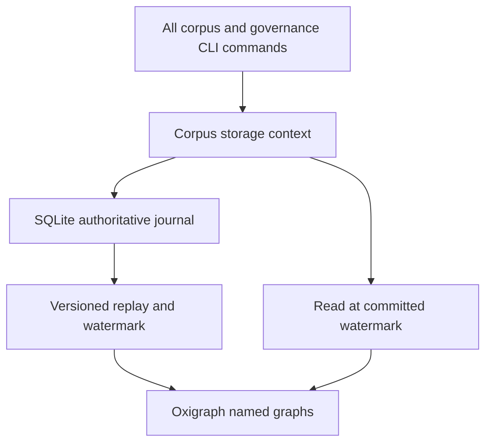
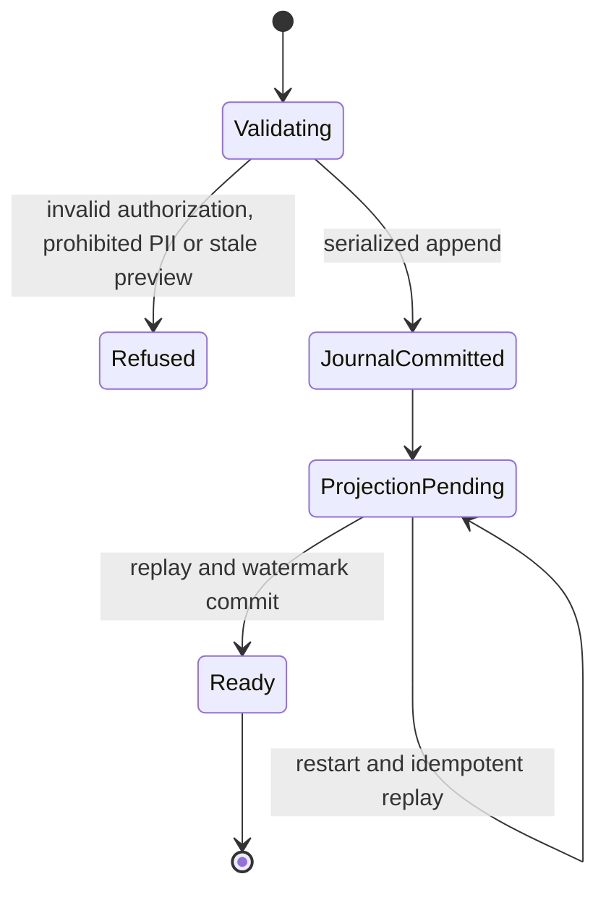

# Phase 13 Persistent Storage - Plan

## Goal Capsule

- Objective: Governance roles, shards and revision history survive process restarts, and a saved retraction preview can be applied safely in a later process.
- Authority: Damien's 2026-09-30 answer authorizes this plan after the [confirmed R18 record](../reviews/2026-09-30-r18-disposition.md); migration-plan U6 owns candidate lineage.
- Execution profile: Planning delivered in U12. Implementation follows separately dispatched U17 envelope work and the canary in U1; no production migration or deployment is authorized by this plan alone.
- Stop conditions: Unsupported schema, failed signature preservation, missing verified snapshot, or failed benchmark blocks the dependent unit.
- Delivery: Integrate this plan with the migration branch. The orchestrator owns implementation dispatch and default-branch integration.

## Product Contract

### Summary

Persist the existing shard and governance interfaces, then wire every CLI caller to one corpus-scoped context. Keep the current authorization and revision invariants while replacing process-local state.

### Problem Frame

`revision/store.py` has only in-memory get/put. Governance CLI commands use a process-local log, and `retract --apply` deliberately raises `NotImplementedError`. Retraction also enumerates `store._d`, so a backend swap alone silently loses the dependency graph.

### Key Decisions

- Storage follows R18 and precedes governance (session-settled: user-directed — chosen over parallel governance implementation: Damien's dated backlog answer fixes the order). Governs R1, R7.
- R18 is adopted as drafted, including revisable vocabulary and identity-only freezing (session-settled: user-directed — chosen over the old PRD envelope as storage authority: the shared model owns the boundary). Governs R1.

### Requirements

**Persistence and integrity**

- R1. Persist the R18-compatible, versioned envelope after U17; preserve original identity, null semantics and signature provenance through migration.
- R2. Shards, revisions, ordered governance events and active roles survive reopening and separate CLI processes with corpus isolation.
- R3. Governance remains append-only and preserves signature verification, genesis handling, authorization, last-admin refusal and monotonic positions under competing writers.
- R4. Saved preview application detects intervening shard or governance changes and commits at most once; denied or stale requests leave authoritative storage unchanged.

**Query, interoperability and operations**

- R5. Preserve named-graph isolation, the Phase 13 eight-format export contract, Gate-2 latency, bulk-load throughput, nightly TTL dumps with local Git commits and snapshot/dump restore requirements.
- R6. Keep existing validation on writes and reject raw-text inputs matching configurable PII patterns (default SSN, ABA and phone patterns) before journal append on shard creation, revision and bulk ingest. Expose the Phase 11 full-SHACL seam explicitly; never report that deferred exit criterion as passed.
- R7. Proposed-class governance implementation begins only after this storage work passes its exit criteria.

### Scope Boundaries

Phase 13 storage is covered; Phases 9–12, 13.5 and 14–20 retain their gates. Production source material and historical book fixtures are excluded. Private-corpus access policy remains Phase 13.5; new persistent artifacts must not expand the existing served-directory boundary.

## Planning Contract

### Key Technical Decisions

- KTD1. Use the existing pinned `pyoxigraph==0.5.7` for queryable RDF and existing `aiosqlite` for the append-only governance/revision journal. The `aiosqlite` comment in `governance/log.py` and the Oxigraph shard seam describe different responsibilities, not mutually exclusive backends. Governs R2, R3, R5.
- KTD2. Make the SQLite journal the authoritative commit record for shard payload/revision changes and governance events; make Oxigraph a replayable projection with a durable applied-position watermark. Never claim atomic commits across two databases. Readers catch up to the committed watermark before returning state; failure closes the context rather than serving a mixed revision. Governs R2–R4.
- KTD3. Serialize writes per corpus through the authoritative transaction. Allocate unique `(corpus, position)` there, verify permissions and preview freshness against that transaction's state, and use a unique operation ID for replay protection. Add UPDATE/DELETE refusal triggers on immutable journal rows. Governs R3, R4.
- KTD4. Extend `ShardStore` with typed corpus-scoped iteration/dependency access and remove `_d` inspection in `governance/retract.py`. Persistent implementations live in a new `storage/` package, outside pure-model dependency boundaries. Governs R2, R4.
- KTD5. Preserve source model versions and signed bytes in the journal. Derived RDF can change through versioned adapters, but transformed content never inherits an old signature. Back up and restore the journal plus projection watermark together; rebuild the projection when needed. Governs R1, R5.
- KTD6. Run ingest PII validation before immutable journal persistence; reject prohibited payloads without altering signed bytes or retaining rejected input in dumps. Keep rdflib adapter-only for validation and serialization, with no authoritative or projection write path through rdflib. Governs R1, R5, R6.

### High-Level Technical Design

Directional component and recovery design:

A committed journal operation whose projection update fails is pending recovery, not an aborted operation. Retrying its ID returns the same operation after recovery. Query/export refuses while recovery cannot finish.

### Risks and Dependencies

U17 is not a no-op: R18 adopts shared-model composites and identity boundaries instead of freezing the old subtype vocabulary. Its separately scoped implementation must compare `shards/envelope.py`, `shards/subtypes.py`, `revision/content_edit.py`, minting/IRI registry, RDF and canonical hash/signature adapters. Preserve IDs and original signed payloads; migrate versioned records explicitly and reject unsupported versions. This plan sizes that prerequisite without implementing the ON SHEET U17 card.

External research is excluded by the network-free lane. Before implementation, verify transaction, backup and replay APIs against the installed pinned packages and their official documentation; API assumptions are not tested by this planning artifact.

## Implementation Units

### U1. Establish schema and benchmark prerequisites

- Goal: Prove that U17's versioned adapters and the current stack support storage.
- Requirements: R1, R5. Dependencies: separately dispatched U17 completed.
- Files: `tests/shards/`, `tests/revision/`, `tests/bench/test_gate1_rdf12.py`, `tests/bench/test_gate2_sparql.py`.
- Approach: Capture synthetic round trips, canonical hashes and original signatures; rerun Gate 2 before backend work.
- Test scenarios: Legacy/current records preserve IDs and explicit nulls; unsupported versions fail; changed signed content fails old-signature verification. Gate-2 warm P95 is below 500 ms; the historical 800 ms ceiling is diagnostic, not a substitute pass.

### U2. Implement durable journal and RDF projection

- Goal: Reopen a corpus without losing shard, revision or governance state.
- Requirements: R1–R3, R5, R6. Dependencies: U1. Decisions: KTD1–KTD6.
- Files: new `src/folio_insights/storage/{context,governance,shards}.py`, `revision/store.py`, `governance/log.py`, new `tests/storage/`.
- Approach: Keep the five-method `GovernanceLog` protocol, provide persistent adapters, and add the typed store query seam. Adapt existing in-memory test doubles to the same protocol. Apply the configurable PII ingest gate to creation, revision and bulk ingestion before journal append.
- Test scenarios: Restart survival, corpus isolation, duplicate operation replay, concurrent writers, journal UPDATE/DELETE refusal, invalid signatures, revoked/last-admin refusal and crash after journal commit but before projection update. Recovery reconstructs exactly the committed state and watermark. Synthetic SSN, ABA and phone inputs are refused on each ingest path, leaving the journal and RDF projection unchanged; permitted synthetic inputs still persist.

### U3. Wire CLI and enable safe retraction apply

- Goal: All command invocations operate on the same persistent corpus state.
- Requirements: R2–R4, R6. Dependencies: U2. Decisions: KTD2–KTD4.
- Files: `governance/cli/_state.py`, all `governance/cli/` callers, `corpus/cli/corpus.py`, `governance/retract.py`, `tests/governance/`.
- Approach: Replace singleton/fresh-store construction, including promote and supersede. Replace private dictionary enumeration before removing the apply refusal. Use existing authorization-first and shared preview builder patterns. Retraction remains an append-only event with effective state derived by projection; it does not delete historical shards.
- Test scenarios: Corpus init and role operations in separate processes; persisted nonempty cascade after restart; preview followed by shard edit or role revocation refuses; unchanged preview commits once; replay does not duplicate an event; missing target refuses. Existing signature and SHACL checks still execute before commit.

### U4. Verify exports, scale and safe restore

- Goal: Meet the remaining Phase 13 storage exit criteria with synthetic data.
- Requirements: R5, R6. Dependencies: U3.
- Files: `storage/`, serialization/export adapters, `tests/storage/`, `tests/bench/`, storage operations documentation.
- Approach: Implement ROADMAP Phase 13's eight formats: `combined.ttl`, `abox/*.ttl`, `tbox.ttl`, `governance.ttl`, JSON-LD, SPARQL CONSTRUCT, N-Quads and Neo4j CSV. Include named-graph and loss-capability checks; reject unsupported lossy representations rather than silently dropping identity or signature metadata. Confirm rdflib remains adapter-only, with RDF projection writes through pyoxigraph. Provide a nightly TTL dump job with local Git commit recording and snapshot/dump restore into a new destination. Production scheduling and publication remain with the orchestrator. Add a validation hook for Phase 11 without bypassing current validation.
- Test scenarios: All eight formats round trip their documented supported content; formats without named graphs have explicit refusal or documented packaging. Synthetic bulk load achieves at least 200K triples/sec under the recorded benchmark setup. A scheduled-job test in a disposable repository produces a TTL dump and a visible local Git commit; rejected PII inputs appear in neither dumps nor default exports. Snapshot restore matches journal positions, roles, revisions and RDF queries; interrupted restore leaves the original intact. Code review confirms no RDF store write path through rdflib. Full SHACL remains explicitly deferred to Phase 11.

## Verification Contract

Use a disposable corpus root and generated test signing identities; never read operator credentials. Run `python -m pytest tests/storage tests/revision tests/governance tests/shards -q` after implementation, plus `python -m pytest tests/bench/test_gate1_rdf12.py -q` and `python -m pytest tests/bench/test_gate2_sparql.py -m benchmark --benchmark-only`. Include cross-process, competing-writer and crash-recovery tests from U2/U3. Record benchmark hardware, fixture size and latency/throughput results. These are implementation exit gates, not results claimed by this plan.

## Definition of Done

U1–U4 satisfy their scenarios, every journal/projection restart is coherent, and `retract --apply` works across processes without private-store access. Document the Phase 11 exception explicitly. No book-derived fixtures or abandoned implementations remain. Before any live conversion, the orchestrator verifies a readable snapshot and rehearses restore; rollback restores that snapshot into a new destination with the matching code version, never mixes schemas or overwrites the only data copy.

## Execution Evidence

### U1 (2026-10-03)

- Tests: `tests/shards/test_storage_prerequisites.py` pins golden canonical hashes and record-byte digests for all five subtypes, simulated journal round trips for legacy (v1) and current (v2) records, explicit-null and identity survival over repeated cycles, original-signature verification after store and reload, and unsupported-version refusal. `tests/revision/test_storage_prereq_signatures.py` shows a content revision fails the original signature while `get_shard_at` history still verifies it.
- Gate 1: `tests/bench/test_gate1_rdf12.py` 32 passed.
- Gate 2 fixture: `fixtures/bench.nq` (gitignored) regenerated from `folio-insights bench gen --seed 42 --target 1000000` (profile `phase-0-gate`; 1,000,000 synthetic quads; sha256 `842066a0c44af9cc5f0f9d4beeff31e9805c43885313cc91e0cfdbf53b7c7837`).
- Gate 2 warm P95 (20 measured rounds, 3 warmup; nearest-rank P95 is the slowest round): all 13 gold queries pass the 500 ms target. Slowest: q13 111.1 ms, q07 37.9 ms, q11 22.6 ms, q09 16.7 ms, q05 4.0 ms; the other eight are under 1 ms.
- Hardware: Intel Core 7 240H (16 logical CPUs, 5.2 GHz max), 61 GiB RAM, Linux 7.0.0-38-generic, Python 3.12.12, pyoxigraph 0.5.7 in-memory store, pytest-benchmark 5.2.3.

### U2 (2026-10-03)

- New `src/folio_insights/storage/`: `context.py` (corpus context, write path, barrier, recovery), `journal.py` (SQLite journal, triggers), `projection.py` (Oxigraph adapter and watermark), `governance.py`, `shards.py`, `pii.py`, `errors.py`. `revision/store.py` gains the typed corpus-scoped seam (`corpus`, `iter_shards`, `dependents_of`); `governance/log.py` gains `InMemoryGovernanceLog._from_history` so both backends run the same gates.
- API checks against the installed packages: pyoxigraph 0.5.7 `Store.update` applies a multi-operation SPARQL update atomically (a failing later operation rolled back an earlier insert); RocksDB holds one lock per path per process, and a live query iterator keeps it, so results are materialized and the handle is dropped before an `flock` on `projection.lock` is released. aiosqlite 0.22.1 over SQLite 3.50.4: `BEGIN IMMEDIATE` serializes writers, WAL plus `synchronous=FULL`; `Connection.backup` exists for U4.
- `tests/storage/`: 53 tests covering every U2 scenario, including subprocess restart survival, three competing writer processes, a process killed between journal commit and projection update, corpus isolation, operation-ID replay, UPDATE/DELETE refusal, invalid signatures, revoked and last-admin refusals, and PII refusal on create, revise, bulk and legacy bulk ingest with both stores unchanged.
- Gate 2 rerun after U2: all 13 warm queries pass; slowest warm round q13 127.5 ms, q07 44.2 ms, q11 29.0 ms. Same hardware as U1.

### U2 review fixes (2026-10-03)

- Closed the verified review findings: replayed governance events (P1-1), uncommitted rows reaching the projection (P1-2), PII in validation errors (P2-1), `*_hash` keys skipping the PII gate (P2-2), `INSERT OR REPLACE` around the immutability triggers (P2-3), bulk replay matching other operations (P2-4), explicit-op_id retry after a later revision (P2-5), and a failed COMMIT leaving the transaction open. Regression tests: `tests/storage/test_review_findings.py`.

### U3 (2026-10-03)

- CLI wiring: every governance and corpus command opens one `CorpusStorageContext` per invocation through `governance/cli/_state.corpus_storage` (`async with`; root from `--corpus-root`, `$FOLIO_INSIGHTS_CORPUS_ROOT`, else `~/.folio-insights/corpora`). The `GOVERNANCE_LOG` singleton and the per-command `InMemoryShardStore` (promote, supersede, retract) are gone. Every CLI write passes an explicit op_id (`genesis:<corpus>` for init, `cli:<command>:<uuid>` otherwise). The append-time verifier is `cached_event_verifier` over the command's own `DidDocCache`, so did:web signers verify from a pre-populated cache and fail closed without one.
- Retraction: `build_cascade_preview` reads `ShardStore.dependents_of` (no `store._d`) and refuses a missing target. The saved preview carries `op_id` and `state_position` (journal head read before the build). `--apply` returns the event already committed under that op_id; otherwise it re-runs the shared builder, signs, and appends with `expected_head`, which storage re-checks inside the write transaction (`JournalStateChanged` -> PreviewStale, exit 2). A losing concurrent apply reports the winner's event. Retraction appends a `RetractionEvent` only.
- Tests: `tests/governance/test_cli_persistent_retract.py` (13; subprocess CLI per step: init and roles across processes, cascade after restart, stale after dependent edit / unrelated edit / role revocation, commit once + replay, three racing applies, missing target at preview and apply, mismatched preview, unauthorized apply, typed-seam builder) and `tests/storage/test_guarded_append.py` (5). `tests/conftest.py` points the CLI corpus root at a per-test temp directory.
- Results: `pytest tests/storage tests/revision tests/governance tests/shards tests/corpus` 571 passed, three consecutive runs; full suite (`-m "not gate5 and not slow" --benchmark-skip`) 1213 passed, 34 skipped (all `tests/bench`: missing gitignored `fixtures/bench.nq` plus `--benchmark-skip`), 17 deselected.

### U4 (2026-10-03)

Operator guide: [`docs/storage-operations.md`](../storage-operations.md).

- **Export formats** (`storage/exports.py`): all eight are serialized and parsed with pyoxigraph.
  - **Per-format capability:** each format declares how it handles named graphs and whether it can carry RDF 1.2 triple terms.
  - **Named graphs:** N-Quads and JSON-LD carry them natively. The per-graph Turtle files (`abox/*.ttl`, `tbox.ttl`, `governance.ttl`) carry them by file layout plus manifest. Neo4j CSV carries them as a `graph` relationship property. `combined.ttl` and CONSTRUCT carry none, so `require_named_graphs` refuses them.
  - **Triple terms:** JSON-LD and Neo4j CSV refuse a dataset that contains one, rather than flattening it.
  - **Signed records:** every whole-dataset format includes `fi:signedRecord`, `fi:signedRecordSha256` and `fi:recordSourceSchemaVersion` per current shard, and `fi:signedEvent` per governance event. These are read from the journal at the projection's watermark. Tests reload the records from N-Quads, JSON-LD, Neo4j and the ABox Turtle file and re-verify their signatures.
  - **Partial CONSTRUCT:** a result that drops a shard's or event's identity and signature triples is refused unless `allow_partial` is set, and the manifest records that it was set.
  - **Loss check:** every file is parsed back and compared. On a mismatch the export raises `ExportLossDetected` and removes what it wrote.
  - **Destinations:** a destination inside the storage root, inside the served output directory, or non-empty is refused.
  - **CLI:** `folio-insights storage export`.
- **Named-graph partitioning:** a shared TBox graph (`https://folio-insights.aleainstitute.ai/tbox`) is loaded from the vocab TTL with deterministic blank-node labels and reloaded when the vocab digest changes. `ctx.query(include_tbox=True)` gives `GRAPH ?g` = {ABox, governance, TBox} for that corpus only (test: `test_named_graph_partitioning_with_shared_tbox`).
- **Bulk load:** `ctx.bulk_load_shards` uses the same checks and the same single journal transaction as `ingest_shards`.
  - **Catch-up:** an add-only catch-up of 2,048 rows or more goes through `Store.bulk_load` and then a transactional watermark update. A crash between the two is recovered by idempotent replay (tested).
  - **Process pool:** per-record checks and N-Quads rendering run in a `forkserver` process pool (8 workers) for batches of 2,048 or more. If the pool fails, they run in-process. The first refusal in input order is the one raised.
  - **Journal:** appends are batched (`executemany`) and revisions are looked up in batches. Current-version rows store NULL `original_bytes`, meaning "identical to payload"; readers substitute the payload.
  - **PII gate:** a digit-run prefilter and lazy field paths, with the same leaves, the same order and the same refusals.
- **Bulk-load benchmark** (`tests/bench/test_storage_bulk_load.py`, marked `slow`): 43,479 synthetic shards projected to 1,000,017 ABox triples, each run into a fresh root. **Target met.** Run 1: 228,278 / 238,164 / 235,467 triples/s (4.38 / 4.20 / 4.25 s), median 235,467. Run 2: 243,908 / 224,988 / 241,693 (4.10 / 4.45 / 4.14 s), median 241,693. The first run in a process includes pool start-up.
  - **Hardware:** Intel Core 7 240H (16 logical CPUs), 61.1 GiB RAM, Linux 7.0.0-38-generic, Python 3.12.12, pyoxigraph 0.5.7 (RocksDB on local disk).
  - **Without the pool:** the in-process path measured about 95–99K triples/s at 460K triples, during development just before the pool was added. The gate depends on the pool.
  - **Not gated:** `rebuild_projection` at 1M takes 18.2–20.3 s (49–55K triples/s), because pyoxigraph deletes are transactional at about 15 µs per quad. Other 1M timings: all seven default exports with round-trip verification took 62.1 s; dump plus commit took 20.1 s; a snapshot took 0.22 s (0.19 s journal-only); a restore took 0.26 s with the projection and 2.38 s with a rebuild.
- **Nightly TTL dump** (`storage/dump.py`, `folio-insights storage dump`): writes `tbox.ttl` and per-corpus `abox.ttl`, `governance.ttl` and `manifest.json` into a dedicated repository.
  - **Verified:** every file is round-trip checked before the commit.
  - **Deterministic:** an unchanged corpus makes no commit.
  - **Committer:** commits go out under `folio-insights dump job <dump-job@folio-insights.invalid>`.
  - **Repository boundary:** a repository nested in another repository, overlapping the storage root, or inside the served output directory is refused.
  - **Test:** `test_dump_writes_ttl_and_a_visible_local_commit` uses a disposable repository and checks `git log`. `restore_ttl_dump` loads a dump into a new pyoxigraph store (the RDF view).
  - **Scheduling and push:** not done. The entry point is documented only.
- **Snapshot and restore** (`storage/backup.py`): under the projection lock, the snapshot takes a `Store.backup` of the projection, then an aiosqlite `Connection.backup` of the journal, then an integrity check, then a manifest.
  - **Restore target:** a NEW destination only.
  - **Assembly:** each restore is assembled in a hidden sibling directory and verified before it is renamed into place. Checks: journal digest, integrity, heads and head-row digests, and a full open and catch-up of each corpus.
  - **Comparison:** tests compare all journal rows (op_ids included), active roles, events, revisions with original bytes, and RDF query results, both with the copied projection and after a rebuild.
  - **Interruption:** a restore interrupted by an exception, or by a process killed with `os._exit`, leaves the destination absent, the snapshot byte-identical and the live root unchanged.
- **Review nit closed:** projection metadata stores the payload sha256 of the watermark row. Recovery rebuilds on a mismatch, and a projection that has no digest is rebuilt once. The test `test_same_length_journal_with_different_content_is_detected` swaps in a journal of the same length with different rows.
- **Phase 11 hook:** `StorageConfig.event_validator` joins `shard_validator`. Both run after the built-in checks and before the journal transaction. Tests cover put, ingest and the parallel bulk path. `status().full_shacl` stays `deferred-to-phase-11` even with hooks installed, and full SHACL remains deferred.
- **rdflib adapter-only:** `tests/storage/test_rdflib_adapter_only.py`.
  - **Source scan:** no rdflib or oxrdflib import in `storage/` or `storage_cli.py`, and no rdflib graph with a `store=` backend anywhere in `src`.
  - **Runtime check:** across the full life cycle, every rdflib graph constructed is in-memory. The only one is the governance SHACL subset adapter used by pyshacl.
- **Found and fixed:**
  - **Quadratic guard trigger.** U2's journal guard trigger OR-ed three conditions inside one `EXISTS`, which made bulk inserts quadratic: 20K shards took 180 s. It is replaced on open by indexed `journal_refuse_replace_v2`.
  - **pyoxigraph string-store bug.** pyoxigraph 0.5.7 (RocksDB) fails an update that inserts, deletes, then re-inserts the same quads ("Not able to find the string … in the string store"). The pre-U4 per-row DELETE/INSERT replay hit this when rebuilding a restored projection. Replay batches now apply only the last revision per subject, with deletes first.
- **Results:**
  - **Plan test set:** `pytest tests/storage tests/revision tests/governance tests/shards tests/corpus`: 631 passed, three consecutive runs.
  - **Gate 1:** 32 passed.
  - **Gate 2:** all 13 warm queries pass. Slowest warm max: q13 115.6 ms, q07 38.3 ms, q11 23.0 ms, q09 16.0 ms.
  - **Full suite:** (`-m "not gate5 and not slow" --benchmark-skip`, `fixtures/bench.nq` regenerated, sha256 `842066a0…7c7837`): 1291 passed, 16 skipped, 18 deselected.
  - **Ruff:** clean on changed files. `src/folio_insights/cli.py` keeps its five pre-existing E402 findings, and the new import is marked `noqa`.

### Follow-ups

- **DONE (2026-10-03): `signed_at`, the signer `did` and `did_doc_snapshot_at` are bound into the signed governance payload.** `GovernanceEvent.signature_payload()` (`governance/events.py`) now hashes the event body plus a `signature_binding` object carrying those three fields and an explicit format marker, `SIGNATURE_PAYLOAD_FORMAT = "folio-insights/governance-event-signature/v2"` (v1 hashed the body only). `governance/cli/_signing.sign_and_verify_event` builds its own bound placeholder, so every CLI signer signs exactly the values it attaches. No v1-signed governance event was ever persisted: governance was in-memory until this branch, and no committed fixture or golden file holds a signed governance event. So the format change breaks no stored data.
  - **Effect on replay:** a legitimate repeat by the same admin (revoke, re-grant, revoke) is now a distinct signed event and is accepted. A replay with a moved `signed_at` fails signature verification (`InvalidSignature`). A verbatim replay under a fresh operation ID is still refused by the storage check on the identical signature value or the identical (signer DID, payload hash) (`GovernanceEventReplayed`).
  - **Not bound:** `signature.action` and `signing_key_id`. The event's own `action` is already in the body, and a tampered `signing_key_id` resolves a key that does not verify.
- **U3 hand-off to U4:** there is still no CLI command that writes shards; shards reach a corpus through `CorpusStorageContext` (`shards.put`, `ingest_shards`) only. Non-retract CLI writes use a fresh op_id per invocation because each invocation signs a new event (new `signed_at`); only `retract --apply` is retry-safe across invocations, through its saved preview.
- **U4 deviations and open items (2026-10-03):**
  - **Bulk-load fixture:** the 1M benchmark loads synthetic shard records through the journal (`bulk_load_shards`), not `fixtures/bench.nq`. That file is RDF rather than shard records, and loading it straight into the projection would bypass the journal.
  - **JSON-LD:** expanded JSON-LD with named graphs, not framed. STORAGE-06's "JSON-LD frames" wording would need a framing library.
  - **Dump restore:** restores the RDF view only. The journal is restored from snapshots.
  - **Dump job:** STORAGE-05's "scheduled Arq job" is an entry point only, per scope. Scheduling and push stay with the orchestrator.
  - **Exit criterion 7 (CORPUS-04):** the v1 advocacy, FRE and Restatement benchmark corpora loading and passing SHACL and cluster validation is NOT met. It needs real corpora and Phase 11 SHACL, both outside this unit.
  - **Full SHACL:** remains deferred to Phase 11.
  - **Rebuild speed:** `rebuild_projection` at 1M (about 19 s) is bounded by pyoxigraph's transactional deletes. Restores that rebuild avoid it by replaying into an empty projection.

