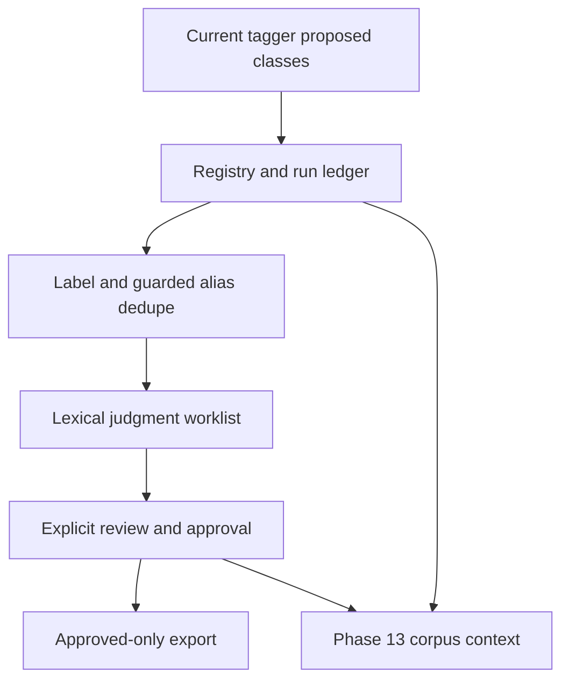

# Proposed-Class Governance After Storage - Plan

## Goal Capsule

- Objective: Collect proposed FOLIO classes, review judgments, record approvals and export only approved proposals with reproducible provenance.
- Authority: Damien's 2026-09-30 answer; migration-plan U14 and KTD5 retain scope and clean-history requirements.
- Execution profile: Plan only in U12; implementation follows verified Phase 13 storage and an orchestrator-prepared clean default-branch base.
- Stop conditions: Storage incomplete, contaminated source data, or unresolved clean-history proof blocks integration.
- Delivery: The orchestrator creates the fresh branch; this worker neither creates it nor replays the old branch.
- Start exception (2026-10-04): Damien said "start now" on 2026-10-04, accepting that CORPUS-04 waits on Phase 11. Phase 13 merged in PRs #11–#13; implementation runs on `feat/governance-pipeline` from clean `origin/master` `cbeff73`. See Execution Evidence.

## Product Contract

### Summary

Reconstruct the reviewed non-evidence code from local `feat/proposed-class-governance` against the current tagger and persistent storage. Bring collect → judge → approve → export across with synthetic fixtures and no historical book-derived artifacts.

### Problem Frame

The old branch has fifteen unmerged commits and conflicts with the current folio-resolve tagger. Its generated registries and worklists contain book-derived excerpts. Replaying its history would also replay that material.

### Key Decisions

- Governance follows Phase 13 (session-settled: user-directed — chosen over the migration plan's parallel execution option: Damien's dated answer fixes the dependency). Governs R1.
- Preserve all reviewed non-evidence code from the candidate (session-settled: user-approved — chosen over abandoning the governance branch: migration-plan U14 carries B4–B9 integration scope). Governs R2.

### Requirements

- R1. Use the completed Phase 13 corpus storage context and preserve its authorization, append-only history and restart behavior.
- R2. Carry the registry, deduplication, judgment worklist, approval and export pipeline plus non-evidence B4–B9 integration changes with their tests.
- R3. Preserve current folio-resolve behavior, including empty-IRI proposed tags never voting in discovery.
- R4. Approval replay is idempotent; invalid decisions or unknown IDs cannot create approved exports, and rejected/pending proposals never export as approved.
- R5. The resulting tree and newly introduced history contain no book-derived evidence, registries, definitions or excerpt-bearing worklists.

### Scope Boundaries

No book extraction, external model judging, upstream FOLIO publication or real-person messages are part of this implementation. Candidate phases beyond U14 remain gated. A worklist prepares human/model review; producing it is not an approval.

## Planning Contract

### Key Technical Decisions

- KTD1. Reconstruct selected code as new commits on the orchestrator's clean default-branch base; never merge, cherry-pick or rebase the historical branch. Use the migration plan KTD5 exclusion list and inspect generated definition/provenance values as well as filenames. Governs R2, R5.
- KTD2. Characterize the current `folio_tagger.py` and discovery behavior before transferring old logic. Resolve the three known conflicts (`.gitignore`, tagger, tagging tests) against the pinned folio-resolve path. Governs R3.
- KTD3. Persist proposal state and decision provenance through the Phase 13 context, keyed by corpus and deterministic proposal ID. Keep the run ledger's idempotency, preserve existing judgments during dedupe, and make repeated identical approvals return the original result/timestamp. Governs R1, R4.
- KTD4. Seed only generated synthetic proposals. Regenerate worklists and approval queues from those inputs; no historical registry import or automatic promotion of machine judgments. Governs R4, R5.

### High-Level Technical Design

Directional data flow:

Decision lifecycle: a collected proposal remains pending until an explicit recorded decision; a rejection stays excluded from export; an approval exports once per stable proposal identity. Changed decisions append new provenance rather than overwriting prior decision history.

## Implementation Units

### U1. Inventory and characterize safe source

- Goal: Establish the transferable file set without importing book data.
- Requirements: R2, R3, R5. Dependencies: Phase 13 exit evidence and clean base available. Decisions: KTD1, KTD2.
- Files: historical `src/folio_insights/proposals/`, `scripts/judge_proposals.py`, `scripts/build_approval_queue.py`, `scripts/apply_approvals.py`, `tests/proposals/`, tagger and discovery tests.
- Approach: Compare code-only paths; record all non-evidence B4–B9 files and tests, including review DB, anchoring, substance, API models and boundary detection. Preserve the July 15 source plan as historical lineage only after inspecting it for prohibited material.
- Test scenarios: Synthetic tagging records current matched/proposed output; empty-IRI tags do not vote; code inventory covers every non-evidence change and excludes all KTD5 evidence paths.

### U2. Reconstruct registry and judgment preparation

- Goal: Collect and deduplicate stable proposals across restarts.
- Requirements: R1–R3, R5. Dependencies: U1. Decisions: KTD2–KTD4.
- Files: `src/folio_insights/proposals/`, `scripts/judge_proposals.py`, `tests/proposals/`, Phase 13 storage adapters.
- Approach: Preserve normalized labels, deterministic IDs, guarded aliases and existing judgments; adapt persistence to the completed context. Keep lexical retrieval/worklist generation offline.
- Test scenarios: Repeated run creates no duplicate; corpus isolation; plural and primary-label dedupe; unsafe alias match stays distinct; existing judgment survives dedupe; restart preserves provenance; worklist generation performs no model call.

### U3. Integrate approvals, export and B4–B9 fixes

- Goal: Explicit approvals produce stable approved-only exports on the current pipeline.
- Requirements: R1–R4. Dependencies: U2. Decisions: KTD2, KTD3.
- Files: approval scripts, `persistence/review_db.py`, anchoring/substance services, `api/db/models.py`, boundary detection, tagger/discovery and associated tests inventoried in U1.
- Approach: Resolve conflicts by current behavior, retain provenance, and reject unknown/invalid decisions. Transfer each non-evidence behavior with characterization coverage rather than transplanting the old tagger wholesale.
- Test scenarios: Pending/rejected items never export; repeated approval preserves timestamp/result; changed decisions retain prior provenance; invalid batch leaves no partial approvals; unknown ID refuses; restart then export reproduces output; all transferred B4–B9 regression cases pass.

### U4. Verify exclusion and review integration

- Goal: Prove the new contribution is independent of contaminated historical data.
- Requirements: R2–R5. Dependencies: U3.
- Files: reconstructed source/test set, integration evidence report.
- Approach: Scan path metadata across the tree and every new commit. Scan only allowed text artifacts for nonempty excerpt fields and derived definitions/provenance, recording findings without printing recovered book spans. Never use old generated artifacts as fixtures.
- Test scenarios: Synthetic nonempty excerpt fixture is detected by the evidence check; field-name references in source code are not mistaken for leaked values. No excluded path is added by any new commit. Diff review accounts for every U1 source inventory entry.

## Verification Contract

After reconstruction run `python -m pytest tests/proposals tests/test_folio_tagging.py -q`, the inventoried B4–B9 suites and Phase 13 persistence tests. Record `git diff --name-status origin/master...HEAD` and a metadata-only new-history path audit against the freshly verified base; local `origin/master` is not proof of remote freshness. Compare file inventory to tests and inspect generated outputs using synthetic data only. No network calls, sends or historical evidence ingestion are needed for local acceptance.

## Definition of Done

All U1–U4 scenarios pass after storage completion. Every non-evidence source change has been transferred or has a reviewed evidence-based exclusion. Tree and new history are clean of book-derived material. No abandoned code remains. Rollback reverts the new integration commits and restores a verified pre-import storage snapshot into a new destination; it never merges or restores the contaminated branch. Publication belongs to the orchestrator after review.

## Execution Evidence

- **Authority.** Damien approved the pipeline "Yes, after Phase 13" (2026-09-30). On 2026-10-04 he said "start now", accepting that CORPUS-04 waits on Phase 11. Phase 13 merged in PRs #11–#13. Branch `feat/governance-pipeline` was cut from clean `origin/master` `cbeff73` (after the history scrub).
- **U1.** The inventory is [`evidence/2026-10-04-governance-inventory.md`](evidence/2026-10-04-governance-inventory.md): 80 changed paths, with 47 transfers, 30 exclusions and 3 superseded. The characterization tests are in `tests/proposals/test_current_tagger_characterization.py`. Finding: on clean master the three empty-IRI discovery cases failed, because the B9 follow-on guard had never merged. U1 re-authors it, so R3 now holds.
- **U2.** `folio_insights.proposals` (registry fold, dedupe, lexicon, offline worklist, `ProposalStore`) and `scripts/judge_proposals.py` (`collect`, `dedupe`, `worklist`) persist through a new scoped seam, `ctx.proposals`: the append-only `proposal_ledger` table in the corpus journal file (`storage/proposals.py`). It has explicit op_ids, the PII gate and `expected_head`. IDs are `PC-` plus `sha256(corpus, normalized label)`. Collection stores no source text. An alias-only FOLIO match stays a distinct `ALIAS_CANDIDATE` under review. Human and model judgments are never overwritten by dedupe. Tests: `tests/proposals/` (synthetic only, including a cross-process restart test and an offline-guarded CLI run).
- **U1+U2 review.** An independent review found 8 P2 findings and 3 nits; there were no P0 or P1 findings. Each has a regression test in `tests/proposals/test_review_findings.py` (plus `tests/storage/test_pii_gate.py::test_integer_leaves_are_scanned`) that failed on the pre-fix tree. The fixes:
  - the PII gate covers op_ids and integer leaves;
  - judgments use an exact, excerpt-free schema;
  - text keys are refused in ledger payloads;
  - worklists are refused inside any git work tree;
  - empty or tiny lexicons are refused;
  - normalization is Unicode-aware, with 32-hex IDs;
  - snapshot and restore verify the ledger;
  - verdict targets are validated.
