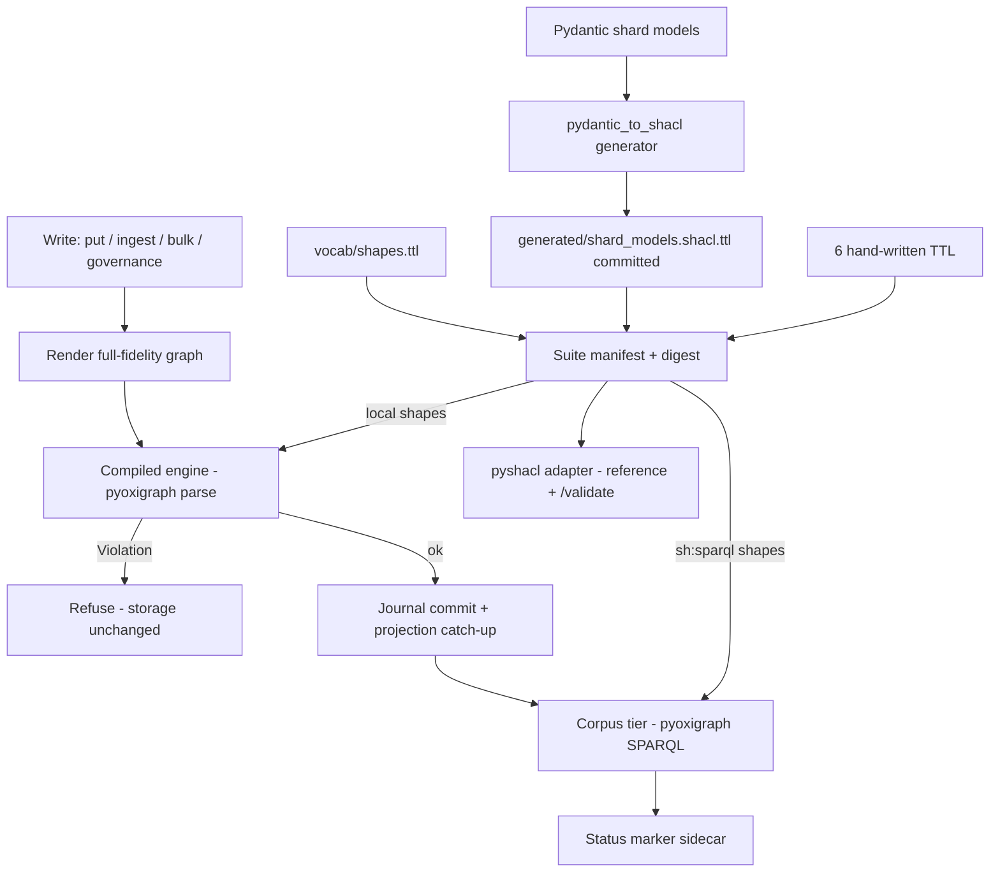

# Phase 11 SHACL Hybrid - Plan

## Goal Capsule

- Objective: Every shard and governance write is checked against one versioned SHACL suite (six hand-written shapes plus shapes generated from the Pydantic models), and `status().full_shacl` reports an honest pass or fail instead of `deferred-to-phase-11`.
- Authority: Decision Sheet `folio-insights-2026-10-04-1531-v2-next-phases`, `q1-phase11-shacl`, answered "Yes, build it next" by Chief (automated first responder, best-practice call; Damien can overrule). Phases 12 and 13.5 are not authorized by this plan.
- Execution profile: one branch (`feat/phase11-shacl`), unit by unit, each unit with tests and synthetic fixtures. No push, no deployment, no production data.
- Stop conditions: a change to a shared data shape or public interface that is not backward-compatible goes back to Damien as a question. Book-derived material is never used. CORPUS-04 needs the three real benchmark corpora; without them the harness runs on synthetic stand-ins and CORPUS-04 stays unmet.
- Delivery: commits on the branch; the orchestrator owns review, push and integration.

## Product Contract

### Summary

Ship the PRD §10 SHACL hybrid: six hand-written shapes for the cross-field and cross-shard rules a model cannot express, a Pydantic-to-SHACL generator for the field-level rules, a fast compiled validator wired into the Phase 13 write hooks, a corpus-level validation command, and `POST /validate`.

### Problem Frame

Phase 13 left an explicit seam. `StorageConfig.shard_validator` and `event_validator` exist, but nothing installs them, and `status().full_shacl` is hard-coded to `deferred-to-phase-11` in the context, the export manifest and the dump manifest. Phase 13 exit criterion 7 (CORPUS-04) waits on this phase.

Re-verified against today's code (2026-10-05):

- **Model shape.** The shard model is the U17 envelope: `schema_version` 2, the frozen identity fields, five subtypes in a discriminated union, and `shards/records.py` as the only path from stored bytes to models.
- **Existing SHACL.**
  - `vocab/shapes.ttl` holds `fi:VocabPinShape`, three enum shapes and `fi:SupersessionAlignmentShape`, which uses `sh:sparql`.
  - `governance/shapes/*.ttl` holds eight event shapes. The governance log already runs them with pyshacl inside `InMemoryGovernanceLog.append`, and the persistent log reaches that path too.
  - `revision/content_edit_shape.ttl` holds the forward-only edit shape.
  - None of these validates a whole shard. None is wired to storage.
- **Projection RDF is lossy by design.** It is the Gate-2 layout. Layer, fork, speech act, BFO category, the subtype fields and the nested models are not projected. So "full SHACL" cannot run over the projection alone. Field-level validation needs a full-fidelity rendering of each record, and only cross-shard rules can run over the projection.
- **Throughput budget.** Bulk load measured 250-260K triples/s against a 200K floor, about 4.0 s for 1M triples. pyshacl needs an rdflib graph per shard, roughly 0.3-1 ms each. Across 43K shards that alone would push the load below the floor. ROADMAP Phase 11 exit criterion 4 also asks for shapes "pre-compiled at startup".

### Key Decisions

- Phase 11 runs before Phase 12 and 13.5 (session-settled: user-directed via the Decision Sheet answer above). Governs all requirements.
- The six hand-written shapes are the ROADMAP's six (envelope, subtypes, governance, supersession, distinguo, signatures). The PRD's longer list is covered inside those files where today's model has the fields, and is listed as out of scope otherwise. Governs R1.

### Requirements

**Shapes**

- R1. Six hand-written TTL shape files parse. pyshacl validates synthetic valid fixtures as conforming. Each synthetic invalid fixture produces its expected message (SHACL-01).
- R2. A Pydantic-to-SHACL generator emits deterministic TTL for every shard model and nested model. A property test shows `Pydantic -> SHACL -> validate(instance)` conforms across all five subtypes and their optional-field variants, and that seeded mutations fail (SHACL-02).
- R3. Generated TTL is committed. A check mode regenerates it and fails on drift, in the test suite and as a Dagger stage (SHACL-04).

**Enforcement**

- R4. Every shard write (put, ingest, bulk load) and every governance append is validated before the journal transaction. A Violation refuses the write and leaves storage unchanged. Warnings never refuse.
- R5. `status().full_shacl` is one of `disabled`, `unvalidated`, `pass` or `fail`. It never claims `pass` for state that was not validated under the current suite. Export and dump manifests carry the same value.
- R6. A corpus-level validation (library call and `storage validate`) checks every current shard and event plus the cross-shard shapes, and records the result.
- R7. Per-shard incremental validation P95 is under 50 ms with a 1M-triple corpus loaded. Bulk load stays at or above 200K triples/s, or the trade-off is stated with numbers. Gate-2 P95 stays under 500 ms (SHACL-03).
- R8. `POST /validate` accepts candidate shard JSON and returns a pyshacl report for valid and invalid candidates. It is documented in OpenAPI (SHACL-05).
- R9. rdflib and pyshacl stay adapter-only, used for in-memory validation and reports. No RDF-store write goes through rdflib, and the storage write path imports neither.

**Corpus**

- R10. A CORPUS-04 harness loads benchmark corpora through storage, runs full validation and reports the cluster-validation step. Real corpora are absent, so it runs on synthetic stand-ins and CORPUS-04 is reported unmet.

### Scope Boundaries

In scope: Phase 11 exit criteria 1-5 and the Phase 13 SHACL seam. Out of scope:

- Phases 12, 13.5 and 14-20.
- The Phase 9.P1 cluster validator, which is not built; the harness reports that step as unavailable.
- PRD §10 rules for fields today's model does not have: framework registry entries, analogical `primeAnalogate` on shards, role-signer checks on shard state, and content-edit immutability across snapshots. That last one is carried by the frozen models and the storage append-only check. SHACL cannot see deletions in one snapshot.
- Production corpora and book fixtures.

## Planning Contract

### Key Technical Decisions

- KTD1. **Hybrid suite, one manifest.** The suite is the six hand-written files under `src/folio_insights/shapes/ttl/`, the generated file under `src/folio_insights/shapes/generated/`, and the existing `vocab/shapes.ttl`. The existing governance-event, content-edit and v1 OWL-export shapes keep their current owners and runners. The suite digest (sha256 over the sorted file bytes) versions every recorded result. Governs R1-R3, R5.
- KTD2. **Full-fidelity rendering, generated from the same field walk as the shapes.** `shapes/rendering.py` turns a shard JSON mapping (`model_dump(mode="json")`, or raw candidate JSON) into a small validation graph:
  - **Predicates:** each field becomes `fi:<camelCase(field)>`. The overlap with the projection is deliberate: `fi:shardType`, `fi:vocabVersion`, `fi:validTimeStart`, `fi:validTimeEnd`, `fi:supersedes`, `fi:supersededBy` and the rest match the Gate-2 layout. A small override map keeps existing vocabulary: `fi:signedAction` for `AttestedSignature.action`, and the projection's `fi:dependsOn*` singular forms.
  - **Nested models:** blank nodes typed `fi:<ModelName>`, with an `fi:listIndex` on list items.
  - **Values:** dicts become key/value nodes. `Any` values become canonical-JSON `rdf:JSON` literals.
  - **Pairing:** the generator and the renderer share one field-spec walk, so they cannot drift apart. Governs R2, R8.
- KTD3. **Generated shapes mirror the model exactly.** One closed `sh:NodeShape` per concrete model (`sh:closed`, mirroring `extra="forbid"`). Each emits:
  - required or optional fields as `sh:minCount` / `sh:maxCount`, and lists without a count bound;
  - `Literal` values as `sh:in`;
  - types as `sh:datatype`: str to `xsd:string`, int to `xsd:integer`, float to `xsd:double`, bool to `xsd:boolean`, datetime to `xsd:dateTime`;
  - `ge`/`le` as `sh:minInclusive`/`sh:maxInclusive`, and `min_length` as `sh:minLength` (str) or `sh:minCount` (list);
  - nested models as `sh:node`.
  Subtype shapes target `fi:<Subtype>`; a generated `fi:Shard` shape checks the discriminator. Output is byte-deterministic: sorted, with no timestamps. Governs R2, R3.
- KTD4. **Severity carries compatibility.** `sh:Violation` (refuses a write) covers:
  - every generated constraint and every hand-written rule that existing code already guarantees, such as the subtype invariants, the vocab pin and the analogia triad;
  - two new integrity rules that no committed fixture breaks: `validTimeStart < validTimeEnd` when both are set, and a signature claiming `verified true` with an empty signature value.
  PRD rules that nothing enforces today are `sh:Warning`: at least one signature, a contested shard needs two or more votes, `superseded` status needs `supersededBy`, `demonstrable` needs a dependency, and the minted IRI and hash forms. Warnings are reported and counted but never refuse, so no write that succeeds today is refused for them. Promoting a Warning to a Violation is a later product decision. Governs R4, R5.
- KTD5. **Two tiers.**
  - **Local tier:** every shape without `sh:sparql`. Compiled at startup into Python closures over the rendered graph (`shapes/compiled.py`). It parses the shape TTL with pyoxigraph, has no rdflib, and fails closed on any SHACL construct it does not implement. It refuses writes before the journal transaction, and runs inside the bulk-load process-pool workers so throughput holds.
  - **Corpus tier:** shapes with `sh:sparql`, such as supersession alignment and reciprocity. These run natively in pyoxigraph over the corpus projection, after commit, for the affected focus nodes: the written shards, shards that point at them, and previously failing nodes. Their result sets the status rather than refusing the write. Cross-shard rules depend on write order (a superseding shard and the superseded shard's closing revision), so refusing them would force batch-only workflows. Reporting keeps writes ordered as today while status stays honest. Governs R4-R7.
- KTD6. **pyshacl is the reference engine.** Differential tests require the compiled engine to agree with pyshacl on every fixture and every generated instance and mutation: same conformance, same (focus node, source shape, severity) set. `POST /validate` and `storage validate --engine pyshacl` use pyshacl over in-memory rdflib graphs (adapter-only). Governs R1, R8, R9.
- KTD7. **Status marker.** A per-corpus sidecar, `<root>/shacl/<corpus>.json`, written atomically under its own `flock`. It records the suite digest, the validated-through journal position and that row's payload sha256, failing Violation focus nodes (capped), and warning counts. `status()` reports:
  - `disabled` when no suite is configured;
  - `unvalidated` when there is no marker, the digest differs, the position or sha does not match the journal head, or a write arrived from a context without the suite;
  - otherwise `pass` or `fail`.
  An incremental write advances the marker only when it is contiguous with it. A full validation always rewrites it. Snapshot and restore do not copy the marker, so a restored corpus reads `unvalidated` until validated. That is the honest default. The journal schema and the projection adapter version do not change. Governs R5, R6.

### High-Level Technical Design

### Risks and Dependencies

- RISK-2 (no ecosystem generator) is answered by an in-repo generator scoped to the constructs the shard models use. Any other annotation fails generation loudly.
- The two-engine design risks divergence. KTD6's differential tests are the mitigation, and the compiled engine refuses constructs it cannot evaluate.
- The default suite runs on every existing storage test. Any existing fixture that newly fails is a compatibility signal: fix the shape severity, never the fixture.

## Implementation Units

### U1. Rendering, generator and committed generated TTL

- Goal: Deterministic field-level shapes for every shard model.
- Requirements: R2, R3. Decisions: KTD2, KTD3.
- Files: new `src/folio_insights/shapes/{__init__,fields,rendering,pydantic_to_shacl}.py`, `src/folio_insights/shapes/generated/shard_models.shacl.ttl`, `scripts/generate_shapes.py`, `tests/shapes/`.
- Test scenarios: two generations produce identical bytes. `--check` passes on the committed file and fails on a perturbed copy. A Hypothesis property test over all five subtypes (optional fields on and off, empty and non-empty lists, nested models) renders each instance and validates it conforming under pyshacl. Seeded mutations each produce a violation: a missing required field, an out-of-enum value, out-of-range confidence, a wrong datatype and an unknown field. An unsupported annotation raises.

### U2. Six hand-written shapes with synthetic fixtures

- Goal: Cross-field and cross-shard rules the generator cannot express.
- Requirements: R1. Decisions: KTD1, KTD4, KTD5.
- Files: `src/folio_insights/shapes/ttl/{envelope,subtypes,governance,supersession,distinguo,signatures}.shacl.ttl`, `src/folio_insights/shapes/suite.py`, `tests/fixtures/shacl/` (synthetic valid and `invalid_shards/` cases), `tests/shapes/`.
- Test scenarios: all six parse. Valid fixtures conform under pyshacl. Each PRD-listed invalid fixture this model can express produces its expected message:
  - supersession without valid-time alignment;
  - a "verified" signature with no signature value;
  - contested with one vote (Warning);
  - an inverted valid-time interval;
  - the disputed epistemic subset;
  - a self-gloss;
  - a broken analogia triad on a distinguo fork;
  - a governance event with an unknown action.
  Severities match KTD4.

### U3. Compiled engine and corpus tier

- Goal: SHACL validation fast enough for the write path, and in agreement with pyshacl.
- Requirements: R4, R7, R9. Decisions: KTD5, KTD6.
- Files: `src/folio_insights/shapes/{compiled,corpus}.py`, `src/folio_insights/shapes/pyshacl_adapter.py`, `tests/shapes/`.
- Test scenarios:
  - **Differential agreement:** the compiled engine and pyshacl agree on every fixture and on Hypothesis instances and mutations.
  - **Fail closed:** an unknown SHACL construct is refused.
  - **Corpus tier:** the SPARQL tier reproduces pyshacl's `sh:sparql` results on a small pyoxigraph store.
  - **Timing:** per-shard validation timing is recorded (microbenchmark, not gated in the quick suite).

### U4. Storage wiring, status and validate command

- Goal: Full SHACL on every write, and an honest `full_shacl`.
- Requirements: R4-R6, R9. Decisions: KTD4, KTD5, KTD7.
- Files: `storage/{context,_parallel,errors,exports,dump,__init__}.py`, new `storage/shacl_status.py`, `storage_cli.py` (`validate`), `docs/storage-operations.md`, `tests/storage/`.
- Approach: `StorageConfig.shacl` defaults to the loaded suite. `None` disables it and reports `disabled`. The existing generic hooks are kept and still run after the suite.
  - **Bulk loads:** large batches validate the local tier inside the pool workers. The earliest-index refusal still wins.
  - **Governance events:** validated against the governance shapes, on the event as the projection renders it, before append.
  - **After commit:** the corpus tier runs on the affected focus nodes and advances the marker.
  - **Full validation:** `validate_corpus()` validates everything and records the result.
- Test scenarios:
  - A Violation refuses put, ingest and bulk (in-process and pooled) and governance appends, leaving journal and projection unchanged.
  - A Warning-only shard commits, and the warning is counted.
  - Status moves `unvalidated -> pass` after full validation, and to `fail` on a cross-shard violation and back to `pass` once it is fixed.
  - A write from a suite-less context makes status `unvalidated`, and a suite digest change does the same.
  - A restored snapshot reads `unvalidated`.
  - Concurrent writers never produce a false `pass`.
  - Export and dump manifests carry the status.
  - The Phase 13 hook tests still pass, with updated status expectations.

### U5. `POST /validate`

- Goal: Validation as a service.
- Requirements: R8. Decision: KTD6.
- Files: `api/routes/validate.py`, `api/main.py`, `tests/test_validate_api.py`.
- Test scenarios: a valid candidate gives 200 with `conforms: true`. Invalid candidates give 200 with `conforms: false` and results: an enum error, a missing field, an unknown field and a malformed datetime. A non-object body gives 422. `/openapi.json` documents the path with request and response schemas. Corpus-tier shapes are not applied to an isolated candidate, and the response says so.

### U6. CI check, CORPUS-04 harness, benchmarks and docs

- Goal: Close the remaining exit criteria with evidence.
- Requirements: R3, R7, R10.
- Files: `ci/build.py` (shapes-check stage), `tests/bench/test_corpus04_harness.py`, `tests/bench/test_shacl_incremental.py`, docs.
- Test scenarios:
  - **Dagger:** the stage runs `scripts/generate_shapes.py --check`. A unit test pins that the stage exists.
  - **CORPUS-04 harness:** three synthetic stand-in corpora load, fully validate and report the cluster step as unavailable.
  - **Incremental validation:** per-shard P95 under 50 ms with a 1M-triple corpus loaded.
  - **Benchmarks:** bulk load and Gate 2 are rerun with the suite enabled, and the results recorded.

## Verification Contract

- **Environment:** a disposable corpus root (`FOLIO_INSIGHTS_CORPUS_ROOT` set to a temp dir), synthetic fixtures and generated identities only.
- **Suites:** the full suite (`-m "not gate5 and not slow" --benchmark-skip`) at or above the 1622 baseline; Gate 1; and Gate 2 on a regenerated `fixtures/bench.nq` (seed 42, 1M).
- **Benchmarks:** `pytest -m slow -k bulk tests/bench` and the incremental microbenchmark.
- **Hygiene:** ruff; `scripts/export_image_locks.py --check`; `scripts/check_exclusions.py --history origin/master`; and `git status --short --ignored output data` must be clean.

## Definition of Done

- U1-U6 satisfy their scenarios.
- `full_shacl` can no longer read `deferred-to-phase-11` anywhere.
- No new dependency (pyshacl, rdflib, pyoxigraph and hypothesis are already pinned).
- No book-derived fixture.
- Unmet criteria (CORPUS-04) are stated plainly in Execution Evidence.

## Execution Evidence

(Filled per unit as work lands.)
