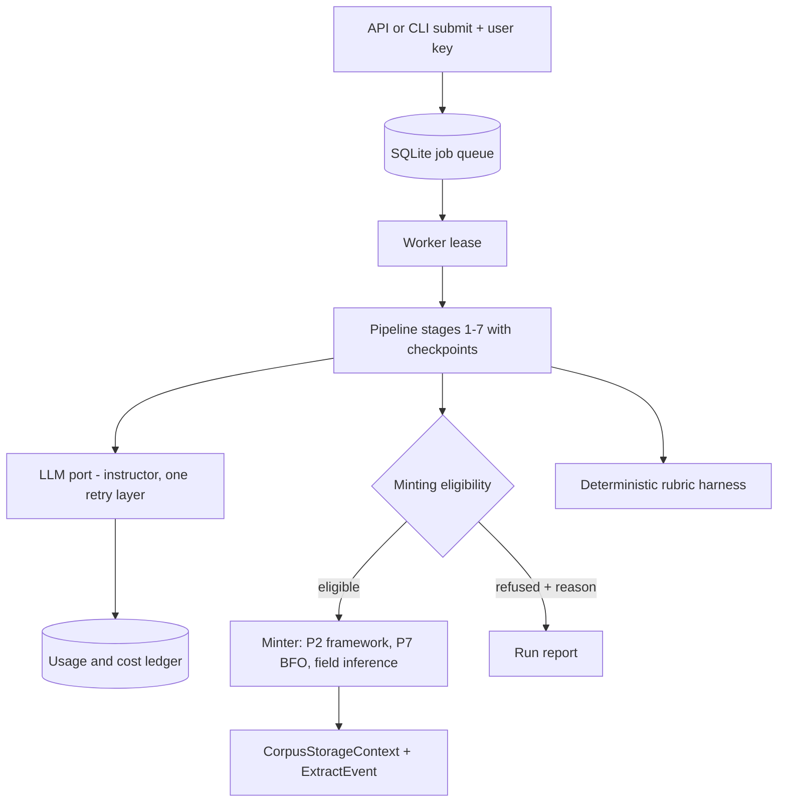
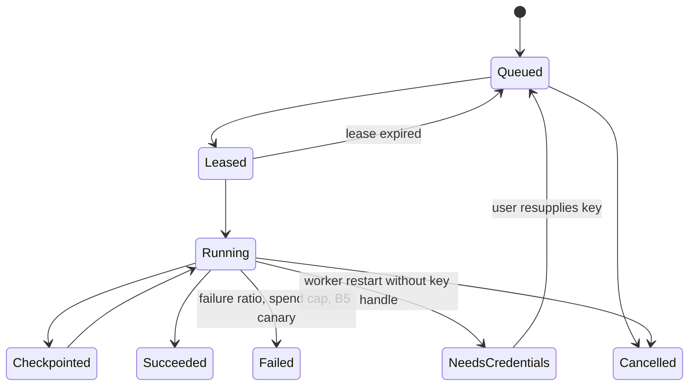

# Phase 10 Pipeline and LLM-Agnostic Re-plan - Plan

## Goal Capsule

- **Objective:** Extraction runs on any supported LLM provider through one tested port. It turns only grounded, verified units into shards in the Phase 13 corpus store, through durable jobs that survive restarts and report their cost.
- **Authority:** Damien's Decision Sheet `folio-insights-2026-10-04-1531-v2-next-phases`, question `q3-phase9-10-pipeline`, was answered "Plan only, then ask" by Chief, the automated first responder. This document is that plan. Building waits for a later yes.
  - **Lineage:** migration-plan U8 (`docs/plans/2026-09-27-1930-refactor-v2-gsd-to-ce-migration-plan.md`) declared the April Phase 10 obsolete as written, and directed a re-plan from the current folio-resolve tagger, `docs/evidence/books/` and `docs/rubrics/extraction-quality-v1.md`.
- **Execution profile:** Plan only. No code, dependency or deployment change is authorized by this document.
- **Stop conditions:**
  - Any unit that would weaken a tagger invariant stops: the LLM never mints IRIs, B9 evidence verification, B5 deterministic-path integrity, anchor verification, B6 substance guard or empty-IRI non-voting.
  - Any run on real, non-public source text outside a private or local-only corpus stops.
  - Any server path that reads a shared LLM key stops.
- **Delivery:** One branch per unit. The orchestrator owns dispatch, review and integration.

## Product Contract

### Summary

The April Phase 10 assumed an untouched v1 seven-stage pipeline. Stage 8 would be appended, `instructor` would be the sole LLM path, Arq and Redis would run the jobs, and a lazy-fill split would leave shards half-filled. Since then the tagger has been rebuilt around pinned `folio-resolve==0.4.0` (`pyproject.toml:38`). That rebuild brought:

- deterministic label resolution;
- place and alias gates;
- source classification;
- a domain-prior judge that can only lower or drop tags;
- calibration recording;
- B9 evidence verification;
- B5 deterministic-path integrity.

The books UAT also found the pipeline generative rather than extractive (`docs/evidence/books/DE-RISK-FINDINGS.md`, findings EP-INSIGHTS-BOOKS-001, -007, -008). Phase 10 keeps the goals, rebuilds the means and adds the evidence gates the UAT showed are needed.

### §9 goal disposition

| §9 / LLM-xx goal | Verdict | Grounding in today's code |
|---|---|---|
| LLM-agnostic extraction (LLM-01) | **Survives; mechanism replaced.** | Provider choice already exists, but only through folio-enrich's registry reached by a `sys.path` bridge (`services/bridge/llm_bridge.py:73-83`). That bridge is unpinned, cannot import in CI (`ci/build.py:351`), adds JSON to the prompt rather than validating it (Anthropic `structured()`), and carries an unfixed OpenAI JSON-mode failure (B3, EP-INSIGHTS-BOOKS-005). `instructor` is pinned (1.15.1) but used only in `polysemy/detector.py:160-166`. folio-resolve contains no LLM client code (verified: no provider SDK imports in the installed package), so there is no folio-resolve provider handling to reconcile. |
| `--llm-provider` / `--llm-model` flags (LLM-01) | **Survives.** | Absent from `extract` and `discover` (`cli.py:38-276`). Only the polysemy CLI has a single-string flag. |
| CI matrix across providers (LLM-01) | **Survives, reshaped.** | CI is Dagger, network-free, with integration tests excluded. A live-key matrix cannot run there. Offline per-provider contract tests run in CI, and a live smoke matrix is an opt-in marker. |
| `extractor_model` + `extraction_prompt_hash` populated (LLM-02) | **Survives.** | Both are required envelope fields (`shards/envelope.py:303-305`), populated today only by fixtures. Stages do not record prompt-template identity. |
| Stage 8 Shard Minter (LLM-03) | **Goal survives; "append to unmodified stages 1–7" is obsolete.** | Stages 1–7 were deliberately modified by B5, B6, B7 and B9 (commits `3ebec1f`, `8306f2d`, `1e15cb5`). Nothing converts a `KnowledgeUnit` into a `Shard`. `mint_shard_iri` (`shards/minting.py:77-94`) and `ExtractEvent` (`governance/events.py:176-180`) have no pipeline caller. Minting becomes a gated post-pipeline step, not an eighth stage. |
| Subtype routing on disagreement markers (§9.1) | **Deferred.** | U17 Open Question 1 (subtypes as shared-model composites under R18) is unanswered. The minter emits one subtype until that is settled (Open Question 4). |
| Lazy-fill with `extraction_phase=partial\|complete` (LLM-04) | **Obsolete.** | The envelope has no `extraction_phase`. All fifteen slots, including `framework_id`, `bfo_category`, `epistemic_status` and `speech_act`, are required, and `extra="forbid"` applies (`envelope.py:217`). A partial shard would need a schema-v3 migration and a later content change, which by U17's rule invalidates its signatures. The cost concern is met another way: enrichment runs before minting under checkpoints and a spend cap. |
| Arq 0.28 + Redis 7.4 (LLM-05) | **Goal survives (durable jobs, no orphans); Arq/Redis dropped.** | The API launches untracked `asyncio.create_task` jobs (`api/routes/processing.py:109`, `api/routes/discovery.py:151`) with one JSON file per corpus (`api/services/job_manager.py`), so a restart orphans them. The pipeline runner also bypasses checkpoints. The worker is an idle stub (`worker.py:24-31`). No Redis runs on the single Hetzner/Coolify host, and Phase 13 already proved serialized SQLite writers (`BEGIN IMMEDIATE`, WAL). |
| Cost meter within ±5%; single-layer retry (LLM-06) | **Survives.** | No token or usage capture exists. Google retries by hand (5×), and the other SDKs use their default retries, so retries nest under any outer layer. |

Evidence-driven additions not in §9:

- **Minting gates.** Gate minting on per-unit grounding: RUB-EXTRACT-05 anchors, the -06 substance guard, and IRI provenance.
- **Fail loud on per-unit errors.** Today the tagger swallows them (`folio_tagger.py:190-193`).
- **Record judge outages.** Today a judge outage silently keeps pre-judge tags (`folio_tagger.py:512-514`).
- **Run the B5 canary.** `verify_deterministic_bridge()` is never called (`services/bridge/folio_bridge.py:143`).
- **Bring your own key.** The project's standing decision requires keys supplied per user, never a shared server key.
- **Automated deterministic rubric harness.** It is the basis for comparing providers.

### Problem Frame

The v2 shard store, governance and identity layers are complete, but empty of real content. Extraction produces KnowledgeUnits that never become shards. Its LLM access is a fragile cross-repo bridge that CI cannot exercise, and its jobs die with the process. Swapping providers without a measured quality gate would repeat the UAT failure mode: a different model, the same unverified output.

### Requirements

**Invariants (must not regress)**

- R1. These tagger invariants hold under every provider, each pinned by an existing or new test:
  - the LLM never mints an IRI;
  - non-ruler IRIs are B9-verified against their evidence, and rejected when the check cannot run;
  - the B5 deterministic path is required by default;
  - the place/alias gates and the 92.0 calibrated bar apply;
  - metadata units emit no tags;
  - empty-IRI tags never vote;
  - the judge can only lower or drop a tag.
- R2. Server code paths never read a shared LLM key. Credentials are supplied per request or per job by the user and are never logged, persisted in job records or written to shards.

**Provider neutrality**

- R3. One in-repo provider port serves every LLM task: the pipeline, discovery, the judge and polysemy. Validated structured output and a single retry layer apply.
  - **Providers:** at least Anthropic, OpenAI, Google and Ollama pass offline contract tests in CI.
  - **Flags:** `--llm-provider` and `--llm-model` work on `extract` and `discover`, with per-task overrides kept.
- R4. Every LLM call records provider, model, prompt-template hash and token usage. A per-corpus, per-run cost ledger matches provider-reported usage × a versioned price table exactly, and is within ±5% of reference invoices on the opt-in live smoke. A configurable spend cap stops a run cleanly.

**Minting**

- R5. A gated minter converts eligible KnowledgeUnits into valid envelope shards, written through `CorpusStorageContext` with a deterministic op_id per unit.
  - **Eligibility:** anchor verified at the rubric's 0.85 bar, the substance guard passed, and every carried IRI from the ruler or B9-verified and judged.
  - **Fields:** `extractor_model`, a stable `extraction_prompt_hash`, Phase 9's framework and BFO assignments, and the inferred philosophical fields with confidence gating.
  - **Refusals:** ineligible units are recorded with reasons and never minted.
- R6. Minting is idempotent. Re-running a run mints nothing new, and identical inputs and templates give identical shard IRIs and prompt hashes. Each minted shard has an `ExtractEvent` in the governance log.

**Jobs**

- R7. Extraction, discovery and worker-tier jobs (Phase 9 cluster validation) run from a durable queue. They survive API and worker restarts, resume from stage checkpoints and never leave orphans. Cancellation is explicit, and SSE progress reads the queue state.

**Quality evidence**

- R8. A deterministic rubric harness scores a run on RUB-EXTRACT's deterministic criteria: 03 IRI validity and branch, 05 anchoring, 09 duplicates, and 10/11 SHACL once Phase 11 lands. Provider comparisons and minting gates use it. LLM-judged and taste criteria stay with the rubric's oracle stack.

### Scope Boundaries

- **In scope:** the provider port, the folio-enrich LLM bridge's retirement from folio-insights, CLI flags, usage and cost capture, the minter, the job queue and worker, API job wiring with per-request keys, the deterministic rubric harness and synthetic fixtures.
- **Out of scope:**
  - Subtype routing beyond the minter's single subtype.
  - Upstream folio-enrich provider fixes.
  - Phase 12 metrics export; this phase produces the usage ledger and Phase 12 exports it.
  - Review UI.
  - Any real-book run in this repository's tree or history. No book-derived fixtures, at any point.

## Planning Contract

### Key Technical Decisions

These are resolved here under the Decision Bar.

- **KTD1. The provider port is built on `instructor.from_provider`.**
  - **Why instructor:** it is already a pinned dependency, already the polysemy path, and gives Pydantic-validated structured output across Anthropic, OpenAI, Google and Ollama with one tenacity-based retry layer. No new dependency is needed, and litellm is not adopted.
  - **Port shape:** `llm/port.py` exposes `structured(task, schema, messages, *, credentials) -> (result, usage)` and `complete(...)`.
  - **Pins:** provider SDKs become explicit optional extras with hash-pinned locks (an `llm` extra), license-logged in `THIRD-PARTY.md`.
  - **Retries:** SDK-level retries are set to 0, so instructor's layer is the only one. Governs R3, R4.
- **KTD2. Retire the folio-enrich LLM bridge here, not upstream.** `LLMBridge.get_llm_for_task` keeps its task names and the `LLM_{TASK}_PROVIDER/MODEL` overrides, but resolves through the port. folio-enrich remains a bridge for ingestion and FOLIO services only. This ends B3 for folio-insights without touching folio-enrich, and lets CI import every LLM path. Governs R3.
- **KTD3. Credentials are values passed in, never ambient on the server.**
  - **CLI:** reads the invoking user's own environment (that user's key).
  - **API:** takes a key per request and passes it into the job as an in-memory secret handle. The handle is held only by the worker that runs the job, never serialized to the queue table, logs or checkpoints. A job whose worker restarts without the handle pauses as `needs_credentials` instead of failing over to an ambient key.
  - **Tests:** prove no key appears in queue rows, logs, checkpoints, shards or exports.
  - Governs R2.
- **KTD4. Prompt identity is hashed per template.** Each LLM stage declares a versioned template ID. Its hash covers template ID, version, system-prompt template and output schema JSON, not unit text. A shard's `extraction_prompt_hash` is the hash over the sorted per-stage hashes of the stages that produced it. Per-stage hashes go in lineage, so identical templates give identical hashes. Governs R5, R6.
- **KTD5. Minting is a gated post-pipeline step that writes complete shards.**
  - **Placement:** it runs after Deduplicator and ConfidenceGate. It reads the run's KnowledgeUnits and evaluates eligibility (R5). It calls Phase 9's framework detector and BFO classifier, and one structured LLM call infers `sense`, `reference`, `logical_form_imputed`, `layer`, `predication_mode`, `fork`, `speech_act` and `verification_method`, each confidence-gated.
  - **Identity:** IRIs are minted from `(source_uri, source_span)` through the existing registry, so minting is idempotent.
  - **Status:** `epistemic_status` and the subtype follow Open Question 1.
  - **Earlier stages:** they change only to record template identity and usage.
  - Governs R5, R6.
- **KTD6. Durable jobs live in a SQLite table, not Arq and Redis.**
  - **Store:** a `jobs` table in a queue database under the storage root (not in corpus journals). It holds leases and heartbeats under `BEGIN IMMEDIATE`, with idempotent enqueue keys. On expiry, a lease returns to the queue and the job resumes from its checkpoint.
  - **Worker:** `worker.py` becomes the consumer and runs worker-tier jobs that need HermiT. The API stops spawning untracked tasks.
  - **Escape hatch:** a `JobQueue` protocol keeps Arq swappable if multi-host scale ever needs it.
  - **Why not Arq and Redis:** a single-host deployment gains nothing from a Redis service except one more stateful component to back up.
  - Governs R7.
- **KTD7. Failures are counted and surfaced, never swallowed.**
  - **Per-unit failures:** the tagger's per-unit exceptions are counted in run metadata, and the run fails above a configurable ratio (default 5%).
  - **Judge outages:** these mark affected tags `unjudged`. The minter treats unjudged non-ruler IRIs as ineligible.
  - **B5 canary:** `verify_deterministic_bridge()` runs at job start.
  - Governs R1, R5.
- **KTD8. Cost is accounting, not estimation.**
  - **Source:** usage comes from each provider response (instructor's completion object).
  - **Pricing:** prices come from a versioned, dated table in the repository with a source note per row.
  - **Ledger:** a per-run ledger sits in the queue database. The ±5% claim is verified against reference invoices on the opt-in live smoke, and the offline test proves exact arithmetic.
  - **Spend cap:** this is a pre-call check, so a run stops before exceeding it.
  - Governs R4.
- **KTD9. The provider matrix has two tiers.**
  - **CI (offline):** per-provider contract tests use recorded response fixtures through the SDKs' injectable HTTP transports. They cover structured output, a malformed response that triggers exactly one retry layer, usage parsing and error mapping.
  - **Live (opt-in):** a `live_llm` marker runs the same synthetic extraction on each provider with the operator's own keys, producing a rubric-harness score table. It is never part of default CI.
  - Governs R3, R8.

### High-Level Technical Design

### Ordering relative to Phases 9, 11, 12 and 13.5

1. **Phase 11 SHACL first.** The harness's SHACL criteria (RUB-EXTRACT-10/11) and the minter's write-time validation use its shapes.
2. **U1–U3 depend on neither Phase 9 nor Phase 11.** They touch only LLM access, jobs and cost, so they can start at any time, including alongside Phase 11.
3. **Phase 9 Wave A before U5 (minter).** That wave covers framework registry and detector, BFO classifier, dependency graph, EL profile and vocabulary reconciliation. The minter must fill `framework_id` and `bfo_category` with real values: signing placeholders and correcting them later means content edits on every shard.
4. **Phase 13.5 before U7's real-source runs.** Shards carry `source_span` text. The nightly dump commits TTL to Git, and exports include signed records. Real non-public sources must land only in a private corpus (13.5) or a local-only root (Open Question 2).
5. **Phase 12 in parallel.** It consumes this phase's usage ledger for OBS-03 metrics, so put the ledger schema in U3 before Phase 12's cost unit.

## Implementation Units

### U1. Provider port and bridge retirement

- **Goal:** Make every LLM call go through one tested, provider-neutral port.
- **Requirements:** R1, R3. **Decisions:** KTD1, KTD2, KTD9.
- **Files:** new `src/folio_insights/llm/{port,providers,templates}.py`, `services/bridge/llm_bridge.py` (delegates to the port), the call sites in `distiller.py`, `knowledge_classifier.py`, `folio_tagger.py`, `boundary/llm_refiner.py`, `services/contradiction_detector.py`, `hierarchy_construction.py`, `polysemy/{detector,fp_audit}.py`, `cli.py` flags, `pyproject.toml` extras with locks and `THIRD-PARTY.md`, new `tests/llm/`.
- **Approach:** Characterize current per-task behavior first with fake providers. Then switch call sites behind the port, keeping task names and env overrides. Add the template registry (KTD4) at the same time, so every call carries its template ID. Remove the unused instructor import in `llm_refiner.py`, and replace `fp_audit`'s mismatched interface.
- **Test scenarios:**
  - Contract tests per provider: valid structured output, a malformed reply with exactly one retry layer, usage parsed, and the provider error mapped.
  - The full existing tagger suites pass unchanged, including B5, B9 and the judge.
  - CI imports every LLM path without a folio-enrich checkout.
  - `--llm-provider`/`--llm-model` reach every task, and a per-task env override wins.

### U2. Durable job queue and worker

- **Goal:** Make jobs survive restarts and leave no orphans.
- **Requirements:** R2, R7. **Decisions:** KTD3, KTD6.
- **Files:** new `src/folio_insights/jobs/{queue,worker,secrets}.py`, `worker.py`, `api/routes/{processing,discovery}.py`, `api/services/{job_manager,pipeline_runner,discovery_runner}.py`, tests.
- **Approach:** Enqueue with an idempotency key. The worker leases, heartbeats and runs through the orchestrator's checkpoint and resume path (the API runner's private stage loop is retired). SSE reads queue state, and `job_manager.py` JSON files migrate to queue rows with an explicit one-time import.
- **Test scenarios:**
  - **Worker kill:** killing the worker mid-stage resumes from the checkpoint on a new lease, and the stage output is not duplicated.
  - **API restart:** the job continues.
  - **Duplicate submit:** returns the same job.
  - **Concurrency:** two workers never run one job.
  - **Cancel:** stops at a stage boundary.
  - **Credential safety:**
    - A restarted job with no key handle goes to `needs_credentials`.
    - A scan of queue rows, logs, checkpoints and outputs finds no synthetic key value.

### U3. Usage ledger, cost meter and spend cap

- **Goal:** Make cost exact and bounded.
- **Requirements:** R4. **Dependencies:** U1. **Decisions:** KTD8.
- **Files:** new `llm/{usage,pricing}.py` with a dated price table, a queue-database ledger table, run report output, tests.
- **Approach:** The port returns usage with every result, and the ledger records task, provider, model, tokens, template hash and computed cost per call. The spend cap is checked before each call.
- **Test scenarios:**
  - The ledger sum equals recorded usage × price exactly on fixtures.
  - A cap stops the run before the call that would exceed it, with the run marked `budget_exhausted` and resumable.
  - The price table rejects rows without a date or source.
  - The live smoke (opt-in) compares the ledger with invoice exports within ±5%.

### U4. Evidence hardening in the tagger and stages

- **Goal:** No silent degradation anywhere on the path to minting.
- **Requirements:** R1, R5. **Dependencies:** U1. **Decisions:** KTD7.
- **Files:** `pipeline/stages/folio_tagger.py`, `services/bridge/folio_bridge.py` (canary call site), `pipeline/orchestrator.py`, tests.
- **Approach:** Count per-unit failures, fail above the ratio, mark tags `unjudged` on judge outage, run the B5 canary at job start, and record per-stage template hashes in lineage.
- **Test scenarios:**
  - Injected per-unit failures above 5% fail the run with a count, and below it the run reports them.
  - A judge outage yields `unjudged` tags, never silently kept ones.
  - A canary failure aborts under `require_deterministic_iri=True`.
  - Template hashes are stable across runs and change when a template changes.

### U5. Gated shard minter

- **Goal:** Make grounded units become complete, idempotently minted shards.
- **Requirements:** R1, R5, R6. **Dependencies:** U1, U4, Phase 9 Wave A, Phase 11. **Decisions:** KTD4, KTD5.
- **Files:** new `src/folio_insights/minting/{eligibility,mapper,minter}.py`, `cli.py` (`extract --mint`, `mint <corpus> --run <id>`), governance `ExtractEvent` emission, tests.
- **Approach:**
  - **Pipeline:** eligibility → framework and BFO assignment (Phase 9) → one structured field-inference call per unit → envelope build → `ingest_shards` with op_id `mint:<run>:<unit-hash>` → `ExtractEvent`, signed if `--signing-key` is given.
  - **Refusals:** every refused unit has a reason code.
  - **Subtype:** one subtype only (Open Questions 1 and 4).
  - **v1 migration:** the warning (Phase 9 U2 function) applies when minting from a legacy corpus.
- **Test scenarios:**
  - **Fabrication:** a synthetic unit with an unverified anchor, a heading-only unit and a unit with an unjudged LLM-path IRI are refused with distinct reasons.
  - **Happy path:** an eligible unit mints a shard that passes envelope validation and Phase 11 shapes.
  - **Idempotency:** a re-run mints nothing new.
  - **Determinism:** identical inputs give identical IRIs and prompt hashes.
  - **Provenance:** every minted shard has an `ExtractEvent` naming `extractor_model`.
  - **Credential safety:** no key appears in shards.

### U6. Deterministic rubric harness

- **Goal:** Make extraction quality measurable and comparable across providers.
- **Requirements:** R8. **Dependencies:** U5 (for minted-shard criteria). Phase 11 is needed for criteria 10/11.
- **Files:** new `src/folio_insights/rubric/{harness,criteria}.py`, the `folio-insights rubric score <corpus> --run <id>` CLI, a synthetic gold set under `tests/rubric/fixtures/`, tests.
- **Approach:** Implement the [DET] checks of RUB-EXTRACT-03, -05, -09, -10 and -11 exactly as the locked rubric defines them, outputting per-criterion scores and gate states. LLM-judged and taste criteria are listed as not scored, never assumed.
- **Test scenarios:**
  - A planted wrong-branch IRI fails -03.
  - A paraphrase with no resolvable anchor fails -05.
  - Duplicates fail -09.
  - The harness never reports a pass for a criterion it did not compute.

### U7. Provider bake-off and default selection (operator-run)

- **Goal:** Make a recorded, evidence-based default model per task.
- **Requirements:** R3, R4, R8. **Dependencies:** U1–U6; Phase 13.5 if any non-public source is used.
- **Files:** the plan's Execution Evidence section, a config defaults change.
- **Approach:** Run the opt-in live matrix on a synthetic or openly licensed corpus. Pick, per task, the cheapest model whose harness gates are all green and whose LLM-judged sample meets the rubric's 0.80 bar, then record cost per 1K units. The bake-off is run by the operator with the operator's own keys, and agents never handle them.
- **Test scenarios:** None automated beyond U6. The evidence is the score table plus a ledger excerpt with no secrets.

## Verification Contract

- **Fixtures and keys:** use disposable roots, synthetic fixtures, fake or recorded providers, and generated signing identities. Never read operator credentials.
- **Per-unit tests:** after each unit, run its tests plus `python -m pytest tests/test_folio_tagging.py tests/test_folio_resolve_pin.py tests/test_extraction_safeguards.py tests/storage tests/governance -q`, then the fast suite (`-m "not gate5 and not slow" --benchmark-skip`).
- **CI import check:** CI must import every LLM path with no folio-enrich checkout.
- **Restart tests:** U2's crash and restart tests run as subprocesses.
- **Exclusion scan:** `scripts/check_exclusions.py --history origin/master` shows 0 findings on every branch, and U7 evidence adds no source text.
- These are implementation gates, not results claimed by this plan.

## Definition of Done

- U1–U6 pass their scenarios, every R1 invariant has a named passing test, and no server path reads an ambient LLM key.
- A synthetic document goes end to end: submitted through the API with a per-request key, run by the worker across a forced restart, and minted into signed-event shards with a cost ledger and a harness report.
- U7's default selection is recorded with evidence.
- The April §9 items are closed as follows:
  - Arq/Redis and lazy-fill are closed as obsolete, with the reasons above copied into ROADMAP's Phase 10 entry.
  - Subtype routing waits on U17 Open Question 1.
- **Rollback:** each unit is a revertible merge. The queue database is new and disposable. Minted shards follow Phase 13's append-only rules; retraction, not deletion, undoes a bad mint.

## Open Questions

### For Damien (product, taste or judgment)

1. **What epistemic status does a machine-minted shard get?** Governance promotes hypotheses to attested status by citation (PRD §3.1.2).
   - **Recommended:** machine extraction enters as `epistemic_status="hypothesis"` with `verification_method="extractor_assertion"`. It is queryable and exportable, but is never treated as attested until a reviewer promotes it. The alternative, attested-by-default, would put unreviewed model output on the same footing as reviewed law.
2. **Where may real, non-public sources be minted?** Shards carry source spans, the nightly dump commits TTL to Git, and the repository just went through a book-history scrub.
   - **Recommended:** copyrighted or non-public sources mint only into Phase 13.5 private corpora, or a local-only root that is excluded from dumps and exports. Public corpora take only openly licensed or public-domain sources.
3. **How high is the minting bar?**
   - **Recommended:** per-unit deterministic gates (anchor verified at 0.85, substance guard, IRI provenance) are required to mint at all. A corpus is marked publishable only after a run-level RUB-EXTRACT pass (all gates green and a weighted score of at least 0.80 on the sampled LLM-judged criteria), so minting and publishing are separate decisions.
4. **Which subtypes should the first minter emit?**
   - **Recommended:** `SimpleAssertionShard` only (or `HypothesisShard`, if Question 1 lands that way). Disputed and conflicting-authority routing waits for your answer to U17 Open Question 1 on restructuring the subtypes under R18, rather than building routing that the restructure might discard.

### Resolved here (technical, per best practice)

- An instructor-based in-repo port, not litellm or the folio-enrich registry (KTD1, KTD2).
- Per-request credential handles that are never persisted, honoring the standing BYOK decision (KTD3).
- Per-template prompt hashing (KTD4).
- Minting as a gated post-pipeline step with complete shards; lazy-fill dropped (KTD5).
- A SQLite lease queue instead of Arq/Redis, behind a swappable protocol (KTD6).
- Counted failures, `unjudged` tags and the B5 canary (KTD7).
- Usage-based cost accounting with a pre-call spend cap (KTD8).
- An offline CI matrix plus an opt-in live matrix (KTD9).
- Google added to the provider set because it is the current default (`config.py:31-32`).
