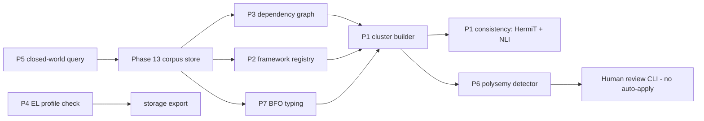

# Phase 9 Seven Design Principles - Plan

## Goal Capsule

- **Objective:** Each of the seven PRD §8 principles becomes a working, independently verified capability over stored shards. The capabilities are cluster validation, framework records, the dependency web, the TBox/ABox profile, closed-world islands, polysemy forks and BFO typing.
- **Authority:** Damien's Decision Sheet `folio-insights-2026-10-04-1531-v2-next-phases`, question `q3-phase9-10-pipeline`, was answered "Plan only, then ask" by Chief, the automated first responder. This document is that plan. Building waits for a later yes. The candidate lineage is migration-plan U7 (`docs/plans/2026-09-27-1930-refactor-v2-gsd-to-ce-migration-plan.md`).
- **Execution profile:** Plan only. No code, vocabulary or fixture changes are authorized by this document. Sub-phases 9.P1–9.P7 map to units U1–U8 below.
- **Stop conditions:**
  - A unit that would change the signed content of stored shards stops for a versioned migration under the U17 rules.
  - A unit that would mint ontology classes into the public TBox without a human disposition stops.
  - A unit that needs book-derived fixtures stops.
- **Delivery:** One branch per sub-phase wave. The orchestrator owns dispatch, review and integration.

## Product Contract

### Summary

Phase 9 turns the seven principles from vocabulary into behavior. Phases 2–8 and 13 already shipped most of the substrate:

- the 15-field envelope with `framework_id`, `bfo_category` and the `depends_on_*` fields;
- the `fi:` vocabulary and the mini-BFO spine;
- the HermiT harness in the worker image;
- the Phase 1 polysemy spike;
- the governance cascade preview;
- persistent named-graph storage with a TBox graph.

What is missing is the logic that uses them. This plan builds that logic as library and CLI capabilities that work on shards in the Phase 13 corpus store. Pipeline call sites belong to the Phase 10 minter.

### Problem Frame

Today no pipeline stage builds a `Shard`. The extraction pipeline still emits `KnowledgeUnit`s (`pipeline/orchestrator.py:136-144`, `models/knowledge_unit.py`), and shards reach storage only through `CorpusStorageContext.ingest_shards`/`bulk_load_shards`, from tests and the bench. The PRD writes several principles as ingest-time pipeline hooks: the framework detector, the BFO classifier and the polysemy pass. Those hooks have nothing to attach to until Phase 10 mints shards. So Phase 9 must deliver each principle as a callable capability with synthetic-shard tests. Phase 10 then calls P2 and P7 when it mints.

Several shipped pieces also contradict each other and need settling first:

- **Undeclared predicates.** The projection writes predicates the vocabulary does not declare: `fi:frameworkId` (`storage/projection.py:162`), `fi:dependsOnPrecedent` and `fi:dependsOnShard` (`projection.py:99-104`). It also writes the framework as a literal, though `fi:framework` is an object property (`vocab/predicates.ttl:79`).
- **BFO mismatch.** The envelope's four-value `bfo_category` (`shards/envelope.py:314-319`) does not line up with the nine-class spine (`vocab/bfo_spine.ttl`). Phase 8 folded `fi:Event` into `fi:Process`, but `occurrent_event` survives in the envelope.
- **Closure semantics.** `fi:closureMarker` (`predicates.ttl:70`) is declared as a Russellian unit-boundary string. PRD §8 P5 instead asks for an `fi:closedUnder` scope annotation.
- **Phantom cascade policy.** The retraction cascade reads a `prefer_latest` strategy that the 8-value `ReconciliationStrategy` literal (`shards/subtypes.py:150-159`) can never hold (`governance/retract.py:175-179`).
- **Polysemy data mismatches.** The spike's fixtures put a literal object on `fi:inFramework`, which the vocabulary declares as an ObjectProperty. Its FP audit calls an interface that `LLMBridge` providers do not expose (`polysemy/fp_audit.py:136-138`).
- **Inverted FP gate.** Phase 1 recorded a PRINCIPLE-06 "pass" against the Wilson **lower** bound: 2 FPs of 22, lower bound 2.53%, upper bound 27.82% (`.planning/phases/01-polysemy-distinguo-spike/01-SUMMARY.md` §2). A ceiling claim ("≤10% FP") needs the upper bound. The spike's own summary flags this as the policy-grade gate it failed.

### Per-principle inventory and sizing

Sizes: S is about 1–2 worker-days, M about 3–5, and L about 6–10, including tests and review fixes.

| Sub-phase | What exists today | What is missing | Size |
|---|---|---|---|
| 9.P1 cluster validator | `reason/hermit_harness.py` (whole-ontology consistency only, no explanation); the worker JRE carries HermiT (`Dockerfile.worker`, `tests/test_worker_jre_modules.py`); the NLI and LLM `services/contradiction_detector.py` over KnowledgeUnit pairs; the `ReconciliationStrategy` literal | `validation/` package; `ShardCluster`/`ClusterBuilder` on four axes; per-cluster consistency with conflicting-shard explanation; `CoverageChecker`; `CrossReferenceChecker`; reconciliation proposals; worker-tier CLI; CI warn-only job | L |
| 9.P2 framework records | Required `framework_id: str` (`envelope.py:287`) with no pattern or registry check; `fi:Framework` class and `fi:framework` predicate; valid-time fields; the `temporal/as_of.py` query helper | `models/framework.py` (`Framework`, `FrameworkRegistry`, SKOS export); starter set; ID pattern and registry check at write time; object-link projection; framework detector library (metadata → corpus config → LLM, confidence-gated); valid-time inference from supplied metadata | M |
| 9.P3 dependency web | Four `depends_on_*` fields; `ShardStore.dependents_of` (one hop) in memory and in Oxigraph (`storage/shards.py:64`); preview/stale/commit retraction (`governance/retract.py`); supersede, contest and resolve events; `HypothesisShard` | `revision/dependency_graph.py` (transitive walk, cycle detection, under 5 s at 10K shards); a cascade policy type separate from `ReconciliationStrategy`; derived effective state for supersession and retraction; `ExtractionHypothesis` container | M |
| 9.P4 TBox/ABox + EL | Shared TBox named graph and per-corpus ABox and governance graphs (`storage/projection.py:87,302-308,423`); `tbox.ttl`/`abox/*.ttl` exports (`storage/exports.py`) | OWL 2 EL profile checker with axiom-level errors; `--tbox-profile=EL\|DL` / `--expressive` on export; reasoner adapter seam | M |
| 9.P5 closed-world islands | `fi:closureMarker` declared but unused; the `temporal/as_of.py` pattern (parameterized SPARQL plus dependency-leak guard) | `fi:closedUnder` and `fi:ClosedWorldScope` vocabulary; `query/closed_world.py` (`ClosedWorldScope`, `ClosedWorldQuery`); an OWA/CWA declaration on every count API | S–M |
| 9.P6 polysemy | `polysemy/` (1,638 LOC): 4-rule detector, prototype centroids, `ForkProposal` with the analogia triad, a review CLI with no auto-apply flag, dispositions, Wilson FP audit; about 46 tests; 20 synthetic fixtures (no civil law) | Upper-bound FP gate with a larger labeled set; threshold policy (B, then C); `owl:disjointWith` seeds; SKOS grouping and jurisdiction-scoped classes in fork output; `fi:distinguishes` emission; API-level subsumption/similarity separation; detector fed by P1 clusters and P2 frameworks; fixes for the `inFramework` and `fp_audit` mismatches | M |
| 9.P7 BFO typing | Nine-class spine and `bfo_mapping.ttl`; required `bfo_category` literal | `bfo/` package (FOLIO-branch → BFO table, rule classifier, LLM fallback); strict/permissive modes; coverage and distribution report; `rdf:type` projection to spine classes | M |

The total is roughly 30–45 worker-days across eight units, about 4–6 calendar weeks with two parallel waves.

### Requirements

**Cross-cutting**

- R1. Every predicate the projection writes is declared in the `fi:` vocabulary. Framework links project as IRIs, and existing data follows a versioned projection rebuild, never a hand migration.
- R2. No unit changes the signed content of an existing shard. Write-time checks go through the Phase 13 `StorageConfig.shard_validator` hook. Any change to the envelope's shape follows U17's versioned-migration rules.
- R3. Synthetic fixtures only. No book-derived text, spans or labels appear in fixtures, tests or plans.

**Principles**

- R4 (P1, PRINCIPLE-01). Given a planted cross-shard contradiction, the cluster validator flags the pair with cluster context and proposes reconciliation strategies, while each shard still passes unit-level validation. It runs only in the worker tier, and CI runs it warn-only.
- R5 (P2, PRINCIPLE-02). Every write checks `framework_id` against the ID pattern and the corpus registry. Detection is deterministic for identical inputs. Detected frameworks and valid-time windows record their evidence, and a shard without a confident framework fails the confidence gate rather than defaulting.
- R6 (P3, PRINCIPLE-03). Dependency DAG construction takes under 5 s for 10K shards and detects cycles. Retraction, supersession and contest produce their PRD §8 P3 effects as derived state, without deleting history.
- R7 (P4, PRINCIPLE-04). Without `--expressive`, a TBox axiom outside OWL 2 EL fails export and names the axiom and the EL constraint it breaks. With `--expressive`, export succeeds with a warning and uses HermiT.
- R8 (P5, PRINCIPLE-05). A negation-as-failure query returns closed results only inside a scope marked `fi:closedUnder`. Elsewhere it returns an explicit "may be incomplete" result, and every count API declares its world assumption.
- R9 (P6, PRINCIPLE-06). The detector's FP rate on the curated set has a Wilson 95% **upper** bound of at most 10%. Auto-apply remains impossible by construction. Fork proposals carry the SKOS grouping, jurisdiction-scoped classes, `fi:analogousTo` and a configurable `fi:primeAnalogate`.
- R10 (P7, PRINCIPLE-07). At least 95% of shards in the synthetic benchmark get a non-default BFO category. Permissive mode records documented defaults, strict mode rejects, and a per-source distribution report exists.

### Scope Boundaries

- **In scope:** library code, CLI subcommands, vocabulary additions, projection changes, synthetic fixtures, benchmarks and tests for the seven principles.
- **Out of scope:**
  - Pipeline call sites and KnowledgeUnit→Shard conversion. Phase 10's minter calls P2 and P7.
  - Review UI tooltips and fork screens (Phases 14–15).
  - Full SHACL shapes (Phase 11).
  - Production corpora.
  - ELK as a runtime dependency.
  - Publishing forks upstream to FOLIO.
- **Deferred:** per-framework-pair polysemy thresholds (Option C), until enough labeled pairs exist to tune them, and LLM-assisted valid-time inference from free text.

## Planning Contract

### Key Technical Decisions

These are resolved here under the Decision Bar. Two competent engineers following best practice would reach the same answers.

- **KTD1. Principles are store-level capabilities, not pipeline stages.** Every capability takes shards from `CorpusStorageContext` (or an in-memory `ShardStore`) and returns findings or derived records. Phase 10 wires P2 and P7 into minting. This removes the dependency on a pipeline that does not yet emit shards, and it lets each principle be tested with synthetic shards. Governs R4–R10.
- **KTD2. No envelope schema bump in Phase 9.**
  - **Framework IDs:** pattern and registry checks run in the `shard_validator` hook at write time.
  - **BFO category:** keeps its four-value literal. A fixed table maps it to spine classes for projection, with `occurrent_event` → `fi:Process` following the Phase 8 fold (see Open Question 3).
  - **Rule:** derived state (effective status, cascade results, BFO `rdf:type`) lives in the projection or in governance events, never in rewritten shard bytes. The U17 rule against signed-content drift stays intact. Governs R1, R2, R6, R10.
- **KTD3. Projection version bump, then rebuild.** Declaring the missing predicates and switching `fi:frameworkId` to an `fi:framework` IRI changes the RDF view, not the journal. Version the projection adapter and rebuild through Phase 13's `rebuild_projection` (about 19 s at 1M triples, per `docs/plans/2026-09-30-0913-feat-phase13-storage-plan.md` U4). Governs R1.
- **KTD4. Cluster validation is hybrid.** Shards carry propositions as text plus typed links, not full OWL axioms, so a pure reasoner pass would find almost nothing. The `ConsistencyChecker` runs HermiT on each cluster's formal content: its TBox slice, typed tags, `owl:disjointWith` seeds and dependency edges. It reuses the existing NLI screen (`services/contradiction_detector.py`), adapted from KnowledgeUnits to shards, for textual contradictions. Each finding records which checker produced it. HermiT stays in the worker image only, and the web tier never imports owlready2. Governs R4.
- **KTD5. Pure-Python OWL 2 EL profile checker; no ELK.** ELK needs the Java OWL API, which has no maintained Python binding. A syntactic EL check over the TBox graph is the standard approach and is enough to enforce the profile. It allows only EL constructors and flags inverse, functional or inverse-functional properties, cardinality above 1, `owl:unionOf`, `owl:complementOf`, universal restrictions and similar. HermiT remains the reasoner for both profiles behind a `Reasoner` protocol, so ELK can be added later without API change. Governs R7.
- **KTD6. Cascade policy is its own type.** Add a `CascadePolicy` literal: `prefer_latest`, `prefer_authority` and `prefer_most_specific_jurisdiction`. It is passed per retraction, as in the PRD's `retract --policy`, and is not read off the shard. Change `classify_dependent` to take the policy explicitly. The unreachable `getattr` path disappears. Governs R6.
- **KTD7. Transitive cascade with bounded effects.** The dependency graph walks transitively with cycle detection: iterative DFS with three-color marking, and cycles reported as findings, not errors. Direct dependents get the policy outcome. Dependents two or more hops away are marked `review_needed`, never auto-re-derived (Open Question 4 can tighten or loosen this). The preview shows the hop depth. Governs R6.
- **KTD8. Closed-world is a new predicate.** Add `fi:closedUnder` (object property → `fi:ClosedWorldScope`) and leave `fi:closureMarker`'s existing meaning alone. Overloading a declared predicate would silently change shipped semantics. `ClosedWorldQuery` follows `temporal/as_of.py`: parameterized SPARQL, `FILTER NOT EXISTS` only inside a bound scope, and a result envelope with `world_assumption: "closed"|"open"`. Governs R8.
- **KTD9. The polysemy gate uses the Wilson upper bound, and N follows the observed FP rate.** Zero FPs need N ≥ 35 to bring the upper bound under 10%. An FP rate near 3% needs about 70, and near 5% about 130. Start with Phase 1's Option B (`TERMS_OF_ART_THRESHOLD = 0.75`; `polysemy/whitelists.py:31` still reads 0.8) and keep per-pair overrides behind a typed config that ships empty. The FP definition counts detector miscalls only. Phase 1 counted "reject with empty rationale", which measures disposition quality, so the review CLI now requires a rationale on every reject. Governs R9.
- **KTD10. Subsumption and similarity are separate at the API level.**
  - **Subsumption:** `polysemy/similarity_query.py` keeps only similarity, and subsumption moves behind the `Reasoner` protocol.
  - **Return types:** the two return distinct types (`SubsumptionResult`, `SimilarityResult`) that cannot be passed for each other.
  - **Guard:** a grep guard test, modelled on `tests/governance/test_grep_guard_three_way_disambiguation.py`, keeps the modules from importing each other's query paths.
  - Governs R9.
- **KTD11. BFO typing is rule-first.** A hand-curated FOLIO-branch → spine table in `bfo/spine.py` covers FOLIO's top-level branches. The rule classifier uses the shard's verified FOLIO tags plus `speech_act`. The LLM fallback goes through Phase 10's provider port when that exists, or a fake provider in tests before then. Permissive mode assigns a documented default per `speech_act` and records `bfo_assignment="default"`. Coverage counts only non-default assignments. Governs R10.
- **KTD12. The framework detector is deterministic before it is generative.** The order is explicit source metadata, then the corpus manifest default, then citation patterns, then the LLM, and the first confident source wins. The LLM may only choose among registered frameworks; it never mints a framework ID. This mirrors the tagger's "the LLM never mints IRIs" invariant (`docs/solutions/llm-path-unverified-iris.md`). Valid-time windows come only from supplied metadata (effective dates, decision dates, publication years); free-text inference is deferred. Governs R5.

### High-Level Technical Design

Each capability writes findings as data: cluster reports, fork proposals and cascade previews. Only signed governance events change effective state.

### Ordering relative to Phases 10, 11, 12 and 13.5

Recommended overall order:

1. **Phase 11 SHACL** next, as the handoff already proposes. Its generator and hand-written shapes then exist before Phase 9 adds data they must validate. Phase 9 does not change the envelope's shape (KTD2), so Phase 11's generated TTL stays valid. 9.U0's vocabulary additions are TBox, not envelope.
2. **Phase 9 Wave A** (U0, U4, U3, U2, U7) after Phase 11, and before Phase 10's minter unit. The minter must fill the required `framework_id` and `bfo_category` fields with real values. Signing placeholder values and fixing them later would need content edits on every minted shard.
3. **Phase 10's minter**, plus **Phase 9 Wave B** (U5, U1, U6) in parallel. Wave B consumes stored shards and does not block minting. Phase 10's provider-port, job-queue and cost units do not depend on Phase 9 and can start earlier.
4. **Phase 13.5** before any Phase 10 run on real, non-public sources (see the Phase 10 plan). It has no ordering constraint against Phase 9.
5. **Phase 12** can run in parallel at any point. P1's worker-tier runs are an early consumer of its tracing.

## Implementation Units

### U0. Vocabulary and projection reconciliation (prerequisite)

- **Goal:** Make vocabulary, projection and envelope agree before any principle builds on them.
- **Requirements:** R1, R2. **Dependencies:** Phase 11 merged (recommended, not required). **Decisions:** KTD2, KTD3, KTD8.
- **Files:** `vocab/predicates.ttl`, `vocab/classes.ttl`, `storage/projection.py`, `tests/vocab/`, `tests/storage/`.
- **Approach:**
  - Declare `fi:dependsOnPrecedent`, `fi:dependsOnShard`, `fi:speechAct`, `fi:bfoCategory`, `fi:closedUnder` and `fi:ClosedWorldScope`.
  - Project `fi:framework` as an IRI under the framework namespace (`vocab/_constants.py:44`) and drop `fi:frameworkId`.
  - Project speech act and BFO category, and bump the projection adapter version.
- **Test scenarios:**
  - A test fails whenever the projection emits an undeclared `fi:` term.
  - A rebuild after the version bump yields IRIs for frameworks, and Gate 2's 13 queries still pass.
  - Journal bytes and signatures are unchanged by the rebuild.

### U1. 9.P1 Cluster validator

- **Goal:** Find cross-shard contradictions that unit-level checks miss.
- **Requirements:** R4. **Dependencies:** U2, U3, U7. **Decisions:** KTD4.
- **Files:** new `src/folio_insights/validation/{clusters,consistency,coverage,crossref}.py`, `reason/hermit_harness.py` (cluster-scoped entry with an explanation of unsatisfiable classes), the `folio-insights validate clusters` CLI, new `tests/validation/`.
- **Approach:**
  - **Cluster axes:** `ClusterBuilder` groups by source document, Tractarian subtree (via `elaborates`), doctrinal neighborhood (shared FOLIO ancestor at a configurable depth) and jurisdiction (through the framework registry).
  - **Checkers:**
    - The consistency checker runs per cluster with HermiT and NLI.
    - The coverage checker flags task-tree leaves without authority shards.
    - The cross-reference checker flags citing shards in incompatible frameworks.
  - **Proposals:** each draws on the eight `ReconciliationStrategy` values and is never applied.
  - **Runtime:** worker-tier entry point only. The CI job is warn-only and non-blocking.
- **Test scenarios:**
  - A planted contradiction across two sources is flagged as a pair with strategies, while both shards pass unit validation.
  - A coverage gap is reported.
  - A cross-framework citation is flagged.
  - Importing `validation.consistency` in the web image fails the existing dependency-leak style guard.
  - A cluster with no formal axioms falls back to NLI and labels its checker.

### U2. 9.P2 Framework registry and detector

- **Goal:** Every shard's framework is a registered, resolvable entity, and detection is reproducible.
- **Requirements:** R5. **Dependencies:** U0. **Decisions:** KTD2, KTD12.
- **Files:** new `models/framework.py`, `frameworks/{registry,detector,valid_time}.py`, a starter `vocab/frameworks.ttl`, CLI `framework register|list|export`, `storage` validator wiring, `quality/confidence_gate.py`, tests.
- **Approach:**
  - **Model:** `Framework` (id, label, jurisdiction, parent; no time scope) with the ID pattern `<jurisdiction>.<body>[.]`.
  - **Registry:** persisted per corpus. A new framework is registered through a signed governance event by the corpus admin. Export is a SKOS concept scheme.
  - **Detector:** returns `(framework_id, source, confidence, evidence)` and the valid-time window with its evidence. The confidence gate fails units without a confident framework.
  - **v1 migration:** the warning and year-suffix stripping become a pure function that Phase 10's minter calls.
- **Test scenarios:**
  - An unregistered or malformed ID is refused at write with the journal unchanged.
  - Identical inputs give identical outputs across 1,000 hypothesis runs.
  - A statute-like synthetic source with effective and amendment dates yields correct windows.
  - The LLM path cannot return an unregistered ID; a fake provider that tries is rejected.
  - The temporal "FRE 702 at T" query returns the right shard.
  - Registering a framework without the admin role is refused.

### U3. 9.P3 Dependency graph and revision effects

- **Goal:** Make the shard web explicit and make the three revision kinds have their PRD effects.
- **Requirements:** R6. **Dependencies:** U0. **Decisions:** KTD2, KTD6, KTD7.
- **Files:** new `revision/{dependency_graph,policies,effective_state,hypothesis}.py`, `governance/retract.py`, `governance/supersede.py`, `storage/shards.py` (bulk adjacency read), CLI flags (`retract --policy`), tests and a benchmark.
- **Approach:**
  - **Graph:** built from one bulk adjacency read, not per-shard queries, with transitive dependents, depth and cycles.
  - **Cascade policy:** passed explicitly.
  - **Effective state:** a projection-derived view.
    - **Supersession:** the old shard reads as `superseded` with `superseded_by` and `valid_time_end` from the event.
    - **Retraction:** direct dependents follow the policy, and deeper dependents read as `review_needed`.
    - **Contest:** the shard reads as `contested`.
  - **`ExtractionHypothesis`:** groups competing `HypothesisShard`s for one source span.
- **Test scenarios:**
  - **Benchmark:** a 10K-shard synthetic DAG builds in under 5 s on the recorded hardware.
  - **Cycles:** a planted 3-cycle is reported.
  - **Retraction under `prefer_latest`:** with a successor, dependents re-derive; without one, they read as aporetic.
  - **Supersession:** both shards stay queryable, and `query_as_of` returns the right one per window.
  - **Contest:** a contest of a just-promoted shard resolves by arbiter distinguo with the signed log intact.
  - **No mutation:** journal payload bytes never change.

### U4. 9.P4 OWL 2 EL profile and export flags

- **Goal:** The TBox stays in EL unless the operator opts in.
- **Requirements:** R7. **Dependencies:** U0. **Decisions:** KTD5.
- **Files:** new `reason/{el_profile,reasoner}.py`, `storage/exports.py`, `storage_cli.py` (`--tbox-profile`, `--expressive`), tests.
- **Approach:** Check the TBox graph against the EL constructor allow-list. Each violation carries the axiom's triples and the rule it breaks. The `Reasoner` protocol has a HermiT adapter.
- **Test scenarios:**
  - A TBox with `owl:InverseFunctionalProperty` fails without `--expressive`, naming that axiom.
  - With the flag, it exports with a warning.
  - The shipped vocabulary TBox passes EL. If it does not, the finding is reported and fixed in U0, not waived.
  - Existing export round trips still pass.

### U5. 9.P5 Closed-world islands

- **Goal:** Negation-as-failure only where a scope says the world is closed.
- **Requirements:** R8. **Dependencies:** U0. **Decisions:** KTD8.
- **Files:** new `query/closed_world.py`, a CLI or API count helper, tests including a dependency-leak guard.
- **Approach:** `ClosedWorldScope` (scope IRI, closed classes and properties) and `ClosedWorldQuery`. Each count function returns its world assumption as data, and Phase 15 renders it.
- **Test scenarios:**
  - "All parties to a contract" returns a closed answer only when the contract's scope carries `fi:closedUnder`. Otherwise it returns an open result with an incompleteness note.
  - Results differ between the two cases on a planted NAF fixture.
  - No count API lacks a world-assumption field (introspection test).

### U6. 9.P6 Polysemy productionization

- **Goal:** Turn the Phase 1 spike into a human-gated production capability with an honest FP gate.
- **Requirements:** R9. **Dependencies:** U1, U2. **Decisions:** KTD9, KTD10.
- **Files:** `polysemy/{detector,distinguo,whitelists,similarity_query,fp_audit,cli}.py`, a new `polysemy/thresholds.py`, synthetic fixtures under `tests/polysemy/fixtures/`, and TBox `owl:disjointWith` seeds.
- **Approach:**
  - **Detector inputs:** the detector reads P1 clusters and P2 frameworks. The `inFramework` mismatch is fixed by emitting IRIs.
  - **Fork output:** fork emission adds the SKOS grouping, the jurisdiction-scoped classes and `fi:distinguishes`.
  - **FP audit:** uses the Phase 10 provider port, or a fake before then.
  - **Labeled set:** agent-authored, synthetic and paraphrased, and it adds a civil-law framework. Dispositions are labeled per Open Question 1.
  - **No auto-apply:** forks never enter the TBox without a recorded human disposition.
- **Test scenarios:**
  - The canonical common-law vs civil-law fixture yields the PRD's fork shape with a configurable prime analogate.
  - No CLI or API path applies a fork without a disposition (existing flag-absence tests, extended to the API).
  - A reject without a rationale is refused.
  - A Wilson upper bound of 10% or less is computed on the labeled set. Until the set is certified, the gate reports `provisional`.
  - The separation guard test passes.

### U7. 9.P7 BFO classifier

- **Goal:** Every shard subject has a BFO category with recorded provenance.
- **Requirements:** R10. **Dependencies:** U0. **Decisions:** KTD2, KTD11.
- **Files:** new `bfo/{spine,classifier,report}.py`, the `folio-insights bfo report` CLI, tests.
- **Approach:** The FOLIO-branch → spine table is curated against `bfo_mapping.ttl`. The rule classifier runs first, then the LLM fallback, then the default (permissive) or a refusal (strict). The report gives the per-source distribution across the four categories and the share of defaults.
- **Test scenarios:**
  - On the synthetic benchmark (all FOLIO top-level branches represented), coverage is 95% or more, excluding defaults.
  - Strict mode refuses an untypeable synthetic shard; permissive mode records the default.
  - The mapping table covers every FOLIO top-level branch, and a test enumerates them.
  - The projection asserts the mapped spine class.

### U8. Phase 9 roll-up verification

- **Goal:** Demonstrate all seven exit criteria together on one synthetic corpus.
- **Requirements:** R1–R10. **Dependencies:** U1–U7.
- **Files:** `tests/bench/`, a synthetic multi-framework corpus generator extending `bench/generator.py`, and the plan's Execution Evidence section.
- **Approach:** One end-to-end run: ingest a synthetic corpus, register frameworks, type BFO, build the DAG, check EL, run CWA queries, validate clusters and detect polysemy. Record hardware and timings.
- **Test scenarios:** Every R4–R10 acceptance test passes in one run, and the full fast suite stays green.

## Verification Contract

Use disposable corpus roots and generated signing identities, and never read operator credentials. After each unit, run its new tests plus `python -m pytest tests/storage tests/revision tests/governance tests/shards tests/vocab tests/polysemy -q`, then the fast suite (`-m "not gate5 and not slow" --benchmark-skip`). Worker-tier units (U1, U4) also run inside the worker image so HermiT is real, not mocked. Benchmarks record hardware and fixture size: the U3 DAG at 10K shards and the U8 end-to-end run. `scripts/check_exclusions.py --history origin/master` must show 0 findings on every branch. These are implementation gates, not results claimed by this plan.

## Definition of Done

- **Acceptance:** U0–U8 pass their scenarios, and each PRINCIPLE-01..07 acceptance test runs in CI. P1 runs warn-only, in the worker stage.
- **Vocabulary and stored data:** the vocabulary declares every projected term, and stored shard bytes and signatures are unchanged.
- **Polysemy gate:** the FP gate reports an upper-bound figure and its certification status honestly.
- **Phase 10 handoff:** a written note lists the call sites Phase 10's minter must use (`frameworks.detector`, `bfo.classifier`, the v1 migration function).
- **Rollback:** each unit is a separate revertible merge. Projection changes roll back by rebuilding with the previous adapter version.

## Open Questions

### For Damien (product, taste or judgment)

1. **Who certifies the polysemy FP gate?** A ceiling claim needs human-labeled dispositions. At a ~3% FP rate that is roughly 70 or more, including new civil-law cases.
   - **Recommended:** agents author synthetic fixtures and first-pass dispositions. You review every agent/LLM disagreement plus a 20% random sample, which is about 20–30 minutes. Until then the gate reports `provisional`, never `pass`. This matches R18's "human review before gold" revision.
2. **Starter framework set.** The PRD fixes the ID pattern and says corpus admins mint new frameworks through signed events. It does not say which frameworks ship by default.
   - **Recommended:** ship the minimum the benchmark and polysemy fixtures need: `us.federal.frcp`, `us.federal.fre`, `us.ucc`, `us.restatement_2d.contracts`, `us.common_law`, `uk.england.common_law` and one civil-law framework (`us.louisiana.civil_code`). Everything else is minted per corpus.
3. **BFO "event".** Phase 8 folded `fi:Event` into `fi:Process`, but the envelope still offers `occurrent_event`, and the PRD's report asks for event counts.
   - **Recommended:** keep the fold, because BFO 2020 treats events as processes. Project `occurrent_event` as `fi:Process` and report it as a sub-count. Restoring a spine class later is a vocabulary revision, not a data migration.
4. **How far does a retraction reach?** The PRD describes direct dependents only, but dependents of dependents also rest on the retracted shard.
   - **Recommended:** transitive reach with graded effects. Direct dependents get the policy outcome (re-derive or aporetic), and deeper dependents are flagged `review_needed`, never changed automatically. The preview shows depth, so a reviewer sees the blast radius before committing.

### Resolved here (technical, per best practice)

- Store-level capabilities, not pipeline stages (KTD1).
- No envelope bump (KTD2).
- Projection versioning (KTD3).
- Hybrid HermiT+NLI cluster checking (KTD4).
- Pure-Python EL checker; no ELK (KTD5).
- `CascadePolicy` separate from `ReconciliationStrategy` (KTD6).
- `fi:closedUnder` added, not overloaded onto `fi:closureMarker` (KTD8).
- Wilson upper-bound gate and the corrected FP definition (KTD9).
- Type-level subsumption/similarity separation (KTD10).
- Rule-first BFO typing (KTD11).
- Deterministic-first framework detection where the LLM never mints IDs (KTD12).
- Phase 1 threshold Option B now, Option C deferred until labeled data supports it.

## Phase 10 handoff (Wave A)

The minter fills `framework_id` and `bfo_category` through these call sites. They live on branch `feat/phase9-wave-a`.

- **v1 migration:** `folio_insights.models.framework.migrate_v1_framework_id(raw)` strips a year suffix and returns its warnings. It raises rather than guessing.
- **Framework detection:**
  - Build `folio_insights.frameworks.detector.FrameworkDetector(registry, corpus_default=..., llm=PortFrameworkLLM())`.
  - Call `.detect(SourceMetadata(...))`, which returns the framework, its evidence and its valid-time window.
  - Gate the result with `quality.confidence_gate.ConfidenceGate().check_framework(detection)`. A failed gate means no shard. There is no default framework.
- **Corpus registry and write check:**
  - Write shards through `frameworks.registry.open_framework_checked_context(root, corpus)`, which installs the `StorageConfig.shard_validator` guard.
  - `load_registry(ctx)` returns the corpus registry.
- **BFO typing:**
  - `folio_insights.bfo.classifier.BfoClassifier(mode=..., llm=PortBfoLLM()).classify(BfoInput(speech_act=..., folio_tags=...))` fills `bfo_category`.
  - `bfo.report.record_assignment(ctx, shard_iri, assignment)` persists its provenance.
- **Starter frameworks:** `frameworks/default_frameworks.json` is provisional until Decision Sheet q3 is answered.
