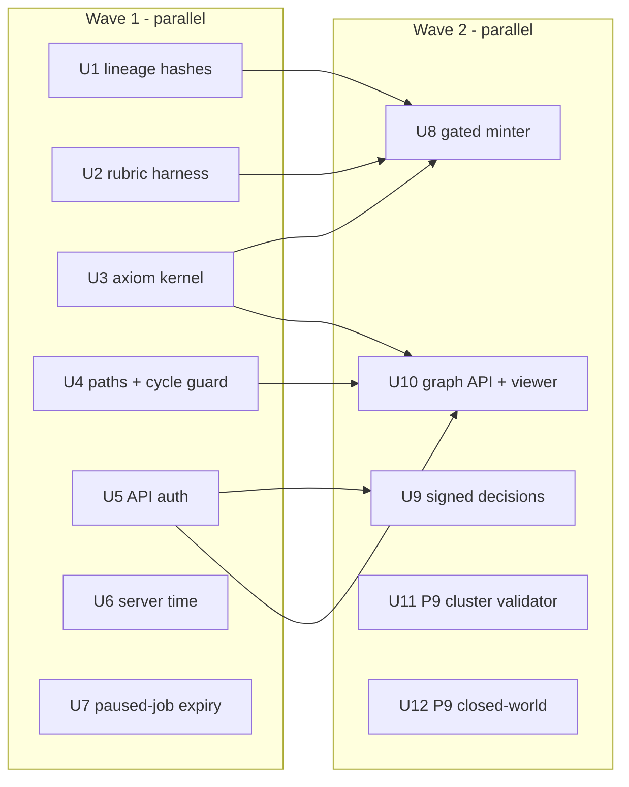

# Shards-as-Axioms Build-out (Friday drain) - Plan

## Goal Capsule

- **Objective:** An operator can turn source text into source-grounded, gated `hypothesis` shards, measure their quality with a deterministic rubric that runs in CI, and trace any shard's derivation back to a public-domain axiom kernel under a human-readable Tractarian path. The server that hosts this refuses unauthenticated writes, trusts its own clock, and does not leave abandoned jobs blocking a corpus.
- **Product authority:**
  - Damien's Friday-drain ask `coding-projects-2026-10-09-1134-friday-quota-drain` (lineup "Big four"; folio direction "Bridge, not merge").
  - Phase 10 build calls on `folio-insights-2026-10-05-0814-p10-build-and-calls` (Chief): q2 minted shards are `hypothesis`; q3 non-public sources only in private or local-only roots; q4 per-unit checks to mint, RUB-EXTRACT ≥ 0.80 to publish; SimpleAssertion first.
  - Phase 10 plan `docs/plans/2026-10-05-0308-feat-phase10-pipeline-replan-plan.md` (U4, U5, U6) and Phase 9 plan `docs/plans/2026-10-05-0308-feat-phase9-design-principles-plan.md` (Wave B U1, U5).
  - `PHILOSOPHY.md` (axiomatic kernel, Part II "Regulae iuris as seed axiom kernel"; Tractarian identifiers, Part IV, around line 295-302; `folio:derivedFromKernel`, closing synthesis).
- **Open blockers:** none for this tranche. Phase 9 U6 (polysemy) stays out: `folio-insights-2026-10-05-0814-p9-build-and-calls` q2 (who certifies the false-positive gate) has only a pending Chief context, no answer (inspected 2026-10-09).
- **Coordination:** the folio bridge lane owns folio-propositions, folio-enrich and a new bridge-ingest module in this repo. This plan does not change `shards/minting.py`'s IRI scheme or any public envelope field (R20). The `axiom_status` lifecycle belongs to that lane and is consumed, not defined, here.

## Product Contract

### Summary

Five capabilities land on `master`: a gated shard minter, per-unit template lineage plus a deterministic rubric harness in CI, a seeded axiom kernel of real Latin maxims with derivation-chain export, Tractarian path identifiers with a cycle guard and a viewer graph view, and a server hardening bundle. A second tranche adds Phase 9's cluster validator and closed-world query islands.

### Problem Frame

The v2 store, governance and identity layers are complete but hold no real content. The v1 extraction produced generative output: on the books UAT about 90% of tags pointed at the wrong concept and offsets did not slice the text they claimed (`docs/evidence/books/DE-RISK-FINDINGS.md`). Nothing converts a KnowledgeUnit into a shard, so the philosophy's central pattern (shards that cite a kernel through explicit dependencies) exists only as vocabulary: `fi:CommonAxiom`, `fi:elaborates` and `fi:dependsOnAxiom` are declared but unused. The API that will host minting has no authentication, governance role windows trust a signer-chosen timestamp, review decisions are unsigned, and a paused job whose control token is lost blocks its corpus forever.

### Key Decisions

- **Source-grounded identity.** A minted shard's `source_span` is the verbatim source slice that the unit's anchor verified, never the LLM's distilled text, so identity and provenance cannot be invented by a model. Governs R1, R2.
- **No envelope change.** Kernel membership, Tractarian paths and kernel derivation use existing envelope fields (`depends_on_axioms`, `elaborates`) plus sidecar registries; nothing new enters the signed envelope. Governs R11, R14, R20.
- **Kernel content is fetched, never generated.** Every kernel maxim is a verbatim substring of a recorded public-domain edition, with URL, edition and SHA-256 of the fetched page; nothing is typed from memory or produced by a model. Governs R9, R10.
- **Kernel status is `authority_only`.** The regulae are accepted on the authority of the Liber Sextus and the Digest, not proved, so seeds enter with `epistemic_status="authority_only"` and `verification_method="textual_citation"`. Chief answered `folio-insights-2026-10-09-1148-kernel-epistemic-status` q1 with this option (tier auto, provenance chief; Damien can overrule). Governs R10.
- **Publishing needs judged scores the harness does not compute.** The deterministic harness alone can never mark a run publishable; it reports `publishable: false` with the missing criteria until judged scores are supplied. Governs R7, R8.
- **Paths are assigned once and never renumbered.** A Tractarian path is persisted at first assignment; later siblings take the next ordinal, so a path cited in prose stays valid. Governs R12.

### Requirements

**Minting (Phase 10 U5)**

- R1. `folio-insights mint <corpus> --run <extraction.json>` converts each eligible KnowledgeUnit into one valid `SimpleAssertionShard` with `epistemic_status="hypothesis"` and `verification_method="extractor_assertion"`, written through a framework-checked storage context with op_id `mint:<run>:<unit-hash>`.
- R2. A unit is eligible only when its anchor verifies at the rubric's 0.85 bar against the source file, it passes the substance guard, and every carried IRI is ruler-derived or B9-verified and judged; each refused unit is reported with a distinct reason code.
- R3. Field inference (`sense`, `reference`, `logical_form_imputed`, `layer`, `predication_mode`, `fork`, `speech_act`) uses one structured port call per unit with a declared template; a field below its confidence floor refuses the unit instead of guessing, and framework and BFO come from Phase 9's detector and classifier.
- R4. Re-running a mint writes nothing new; identical inputs and templates give identical shard IRIs and `extraction_prompt_hash`; each minted shard gets an `ExtractEvent` naming `extractor_model`, signed when `--signing-key` is given.
- R5. A source marked non-public mints only into a corpus configured private or local-only; otherwise the mint refuses before any LLM call.

**Lineage and rubric (Phase 10 U4, U6)**

- R6. Every lineage event written by an LLM-backed stage records the template ID and template hash it used, and a unit's prompt hash is derivable from its own lineage alone.
- R7. `folio-insights rubric score` computes RUB-EXTRACT-03, -05, -09, -10 and -11 exactly as `docs/rubrics/extraction-quality-v1.md` defines their [DET] parts, reports per-criterion scores and gate states, and lists every LLM-judged or taste criterion as `not_scored`, never as passed.
- R8. CI runs the harness on a committed gold set: synthetic fixtures that reproduce each books-UAT failure mode with expected outcomes, plus the human mapping corrections in `docs/evidence/books/mapping-corrections.gold.json`; the suite fails if any expected score drifts.

**Axiom kernel**

- R9. The kernel ships the 88 regulae iuris of the Liber Sextus (VI 5.12.1-88) and the fragments of Digest 50.17, each with its citation, Latin text and source provenance, as data in the package.
- R10. `folio-insights kernel seed <corpus>` writes each maxim as a kernel shard (projected as `fi:CommonAxiom`) whose IRI is minted from the maxim's canonical citation URI and Latin text, so seeding is idempotent and the IRIs are stable across machines.
- R11. `derived_from_kernel(iri)` walks `depends_on_axioms` and `elaborates` transitively and returns each kernel shard reached with its path, and `folio-insights kernel chain <corpus> <iri>` exports that derivation chain as JSON or Turtle.

**Tractarian paths and acyclicity**

- R12. Each shard in a corpus gets a Tractarian path (`1`, `1.1`, `1.2.3`) derived from its primary `elaborates` parent, kernel shards forming the top level, shown alongside the hash URN in CLI output, API responses and the viewer.
- R13. A write that would close a cycle in the dependency graph (dependency fields plus `elaborates`) is refused with the cycle named, and `folio-insights validate graph <corpus>` reports any cycle already stored.
- R14. The viewer shows a shard's dependency graph: its derivation chain to the kernel, its dependents, and every node's Tractarian path and IRI.

**Hardening**

- R15. API routes that change state require an operator bearer token; tokens are stored only as hashes, configured outside the repository, and a non-loopback request without a valid token is refused.
- R16. A review or proposed-class decision may carry a signature by a registered DID key; a signed decision is verified before it is stored and the store records the verified signer, and a corpus can require signatures.
- R17. Governance role windows and authorization use the server's commit time; an event whose `signed_at` is more than the skew from server time is refused at append.
- R18. A job paused as `needs_credentials` or `budget_exhausted` longer than a configurable TTL is cancelled by the worker sweep with reason `expired`, which frees the corpus for new jobs.

**Tranche 2 (Phase 9 Wave B)**

- R19. Phase 9 U1 (cluster validator) and U5 (closed-world islands) meet the requirements and test scenarios in the Phase 9 plan; U6 waits for p9 q2.

**Coordination**

- R20. The shard IRI recipe in `shards/minting.py` and the envelope's public fields stay unchanged; any change would first be recorded in `docs/handoffs/2026-10-09-drain-coordination.md` for the bridge lane.

### Acceptance Examples

- AE1. **Covers R2.** A synthetic unit whose distilled text is fluent but whose snippet matches its source at 0.62 is refused `anchor_unverified`; a heading-only unit is refused `not_substantive`; a unit with an `unjudged` LLM-path IRI is refused `iri_unjudged`. None is minted.
- AE2. **Covers R1, R4.** Minting the same run twice yields the same IRIs, writes no new rows the second time and leaves one `ExtractEvent` per shard.
- AE3. **Covers R7.** A run with no judged scores reports all five DET criteria with numbers and `publishable: false`, listing -01, -02, -04, -06, -07, -08, -12, -13, -14 as `not_scored`.
- AE4. **Covers R11, R12.** A synthetic shard that elaborates a hypothesis which depends on regula VI 5.12.6 ("Nemo potest ad impossibile obligari") exports a two-hop chain ending at that kernel shard, and its path sits under that kernel shard's path.
- AE5. **Covers R13.** Writing shard B that depends on A, when A already depends on B, is refused and names `A -> B -> A`.
- AE6. **Covers R17.** An event signed with `signed_at` set one hour in the past is refused; one within the skew is accepted and its role window is evaluated at commit time.
- AE7. **Covers R18.** A `needs_credentials` job older than the TTL becomes `cancelled` with reason `expired`, and an exclusive enqueue for that corpus then succeeds.

### Scope Boundaries

- **Deferred:** Phase 9 U6 polysemy (p9 q2); Phase 10 U7 operator bake-off; subtype routing beyond SimpleAssertion (U17 Open Question 1); Phase 13.5 private corpora (R5 refuses instead); production deployment; English translations of the maxims (modern translations are not public domain).
- **Not this lane:** the `axiom_status` lifecycle, folio-propositions, folio-enrich, and bridge-ingest.
- **Never:** book-derived fixtures or real non-public source text in the tree.

### Dependencies / Assumptions

- Public-domain Latin editions of the Liber Sextus and the Digest are reachable for fetching; if fewer than 88 regulae verify, the kernel ships only the verified ones and reports the gap.
- Kernel frameworks (canon law, Roman law) are registered in the kernel corpus by a signed admin event at seed time; they are not added to the default framework set.

### Outstanding Questions

- **Resolved in planning:** Tractarian paths need no registry; they are derived from journal order (KTD8).
- **Resolved by Chief:** kernel epistemic status is `authority_only` (`folio-insights-2026-10-09-1148-kernel-epistemic-status` q1).

### Sources / Research

- `src/folio_insights/shards/envelope.py` (fields `elaborates`, `depends_on_*`), `shards/subtypes.py`, `storage/context.py` (`ingest_shards`, `_append_governance`), `revision/dependency_graph.py` (`cycles()`), `frameworks/registry.py` (`open_framework_checked_context`, `SIGNING_SKEW`), `jobs/queue.py` (`reclaim_expired`), `vocab/classes.ttl:27` (`fi:CommonAxiom`).
- `docs/rubrics/extraction-quality-v1.md` (locked rubric), `docs/evidence/books/` (UAT findings and gold corrections).

## Planning Contract

### Key Technical Decisions

- **KTD1. Minted `source_span` is the verified source slice.** The minter re-verifies the unit's anchor against the source file (char-span slice, else `rapidfuzz` partial ratio ≥ `services/anchoring.MIN_ANCHOR_SCORE`), and passes the verified slice, not `unit.text`, to `mint_shard_iri` through `ShardIRIRegistry`. The distilled text goes into `triple`/`sense`. Governs R1, R2, R4.
- **KTD2. Per-unit prompt identity comes from lineage.** `StageEvent` gains optional `template_id` and `template_hash`; `record_lineage` accepts them; `llm/templates.py` gains `unit_prompt_hash(lineage)` = `combined_prompt_hash` over the hashes in that unit's lineage. The run-level `llm.templates` summary stays. Optional fields keep old `extraction.json` files loadable. Governs R6, R4.
- **KTD3. Field inference fails closed.** A registered template `mint.fields.v1` returns the seven fields, each with a confidence; a field below its floor (default 0.6, configurable) refuses the unit with `field_low_confidence:<field>`. With no LLM configured the minter refuses every unit with `field_inference_unavailable`; it never fills defaults. `framework_id` comes from `FrameworkDetector` (refuse `framework_unconfident` when not confident), `bfo_category` from `BfoClassifier` in strict mode (refuse `bfo_unclassifiable`). Governs R3.
- **KTD4. The harness scores two artifact kinds through adapters.** A `UnitRun` adapter reads `extraction.json` plus the source directory; a `ShardCorpus` adapter reads a storage corpus. Criteria are pure functions over the adapter; -03 takes an injectable `IriOracle` (CI uses a frozen fixture oracle, operators the real FOLIO through `folio-resolve`); -10/-11 reuse `shapes/` and the export checks. Results carry `computed: bool`; `publishable` requires every gate green plus judged scores supplied through `--judged <file>`, weighted per §3 of the rubric. Governs R7, R8.
- **KTD5. The books gold set is synthetic text over real failure modes.** `tests/rubric/fixtures/books_gold/` holds authored synthetic sources and units, one case per books-UAT finding (EP-INSIGHTS-BOOKS-001, -002, -007, -008 and the place/heading mismaps), with `expected.json` per case. The human corrections file is scored as a mapping-gold check (pipeline IRI vs correct IRI). No book text is copied. Governs R8.
- **KTD6. Kernel data is a verified package resource.** `src/folio_insights/kernel/data/{liber_sextus_regulae,digest_50_17}.json` carry citation, Latin text, edition, source URL, retrieval time and source SHA-256, produced by a fetch-and-verify script kept under `scripts/kernel/`. Canonical citation URIs are `urn:folio:kernel:liber-sextus:5.12.<n>` and `urn:folio:kernel:digest:50.17.<n>`; the shard IRI is `mint_shard_iri(citation_uri, latin_text)`, so the recipe is untouched. Governs R9, R10, R20.
- **KTD7. Kernel shard fields are deterministic, not analysed.** `shard_type="simple_assertion"`, `layer="L0_primitive"`, `speech_act="statutory_text"`, `epistemic_status` from one constant (`authority_only`, Chief-answered), `verification_method="textual_citation"`, `triple` = (`<shard IRI>`, `fi:assertsMaxim`-equivalent existing predicate or `rdfs:comment`, Latin literal) chosen from the existing vocabulary, `sense`/`reference` = Latin text and citation, `logical_form_imputed` = `"unanalysed"`, `confidence=1.0`. Frameworks `ius_commune.canon.liber_sextus` and `ius_commune.roman.digest` (IDs adjusted to the registry pattern) are registered in the target corpus by a signed admin event at seed time. Kernel membership = IRI in the packaged kernel manifest. No new envelope field and no `VOCAB_VERSION` change. Governs R10, R20.
- **KTD8. Derivation and paths are derived views, recomputable from the journal.** `kernel/traversal.py` walks `depends_on_axioms` and `elaborates` (BFS, cycle-safe) and stops at kernel IRIs. A Tractarian path's parent is `elaborates[0]`, else `depends_on_axioms[0]`, else none (a root); sibling ordinals follow each shard's first commit position, so new shards only append and existing paths never renumber unless a content edit moves a shard's parent. No sidecar store is needed. Governs R11, R12.
- **KTD9. The cycle guard runs in the ingest transaction.** Before commit, `ingest_shards` and `shards.put` check the batch's new edges (dependency fields plus `elaborates`) against the committed graph and refuse with `DependencyCycle(path)`; a `StorageConfig.refuse_dependency_cycles` flag defaults to `True`. Governs R13.
- **KTD10. API auth is a FastAPI dependency on mutating routes.** `api/auth.py` reads `FOLIO_INSIGHTS_API_TOKENS_FILE` (lines of `sha256-hex handle role`, mode-checked, outside the repo). Mutating routes depend on `require_operator`; the job control token stays as a second factor for job control. With no tokens file, only loopback clients may mutate, and only when `FOLIO_INSIGHTS_API_AUTH=loopback-open` (test and local-dev default via conftest); otherwise refusal is 401. Reads stay open, as deployed. Governs R15.
- **KTD11. Decision signatures reuse the governance signing stack.** A decision carries an optional `AttestedSignature` over the JCS hash of the decision body; verification uses `identity/verifier.verify_attestation` with the did:key resolver; the stored row records `signer_did` and `signature_verified`. `FOLIO_INSIGHTS_REQUIRE_SIGNED_DECISIONS=1` (or a corpus setting) refuses unsigned decisions. Governs R16.
- **KTD12. Server time governs governance.** The append path passes the transaction's `committed_at` into the role and authorization checks; history replay uses stored `committed_at`; `signed_at` must be within `frameworks.registry.SIGNING_SKEW` of server time at append. The signature payload format is unchanged. Governs R17.
- **KTD13. Paused-job expiry lives in the sweep.** `JobQueue.expire_paused(now, ttl)` runs from `reclaim_expired`'s caller in `JobWorker.run_once`; `FOLIO_INSIGHTS_JOB_PAUSED_TTL_SECONDS` defaults to 86400; expired jobs become `cancelled` with `error="expired"` and drop any credential holder. Governs R18.

### Sequencing

Each unit runs in its own worktree branched from the integration branch `feat/drain-shards-axioms`; the orchestrator merges each into the integration branch, reruns the suite, reviews, and ships one PR per wave. Every unit that adds a CLI group defines it in its own module and adds exactly one `cli.add_command(...)` line at the end of `src/folio_insights/cli.py`.

## Implementation Units

### U1. Per-unit template hashes in lineage (Phase 10 U4 remainder)

- **Goal:** a unit's prompt hash is derivable from its own lineage. **Requirements:** R6. **Decisions:** KTD2.
- **Files (owned):** `src/folio_insights/models/knowledge_unit.py` (StageEvent only), `src/folio_insights/pipeline/stages/base.py` (`record_lineage`), the LLM-backed stage call sites that record lineage (`pipeline/stages/distiller.py`, `knowledge_classifier.py`, `folio_tagger.py`, `services/boundary/llm_refiner.py` if it records lineage), `src/folio_insights/llm/templates.py` (`unit_prompt_hash`), new `tests/pipeline/test_unit_template_lineage.py`.
- **Test scenarios:** stage events from LLM stages carry the template ID and hash; `unit_prompt_hash` is stable across runs and changes when a template's text changes; an old `extraction.json` without the fields still loads; deterministic-only stages record no hash.

### U2. Deterministic rubric harness and gold set (Phase 10 U6)

- **Goal:** extraction quality measurable in CI. **Requirements:** R7, R8. **Decisions:** KTD4, KTD5.
- **Files (owned):** new `src/folio_insights/rubric/{__init__,adapters,criteria,harness,oracle,gold,cli}.py`, one `cli.add_command` line, new `tests/rubric/**` including `tests/rubric/fixtures/books_gold/**` and `tests/rubric/fixtures/folio_oracle.json`.
- **Test scenarios:** a planted wrong-branch IRI fails -03 and caps mapping at 1; an empty-IRI tag without `proposed_class` fails -03; a paraphrase with no verifying anchor fails -05 (gate) while a 0.85-0.92 snippet scores 2; duplicate `content_hash` and heading-as-unit fail -09; SHACL criteria are `computed: false` on a unit run and computed on a shard corpus; `publishable` is false without judged scores and true only with all gates green plus a weighted ≥ 0.80; the harness never reports a criterion it did not compute; every books_gold case matches its `expected.json`; the mapping-gold check reproduces the recorded baseline for `mapping-corrections.gold.json`.
- **Implementation notes (as built):** RUB-EXTRACT-09 follows the rubric's bands, so a single duplicate or heading scores 2 (a pass); the gold cases fail -09 with two of four units flagged. A -05 match above 0.92 scores 3; a WARN-only -11 passes its gate at 2. Gold fixture units stay under eight words and carry no `source_snippet` values, so the committed files pass `scripts/check_exclusions.py`; snippet scoring is tested on units built in code. The mapping-gold baseline is 0 of 1 agreement (`tests/rubric/fixtures/mapping_gold_expected.json`).

### U3. Axiom kernel seed, traversal and chain export

- **Goal:** a real kernel to derive from. **Requirements:** R9, R10, R11, R20. **Decisions:** KTD6, KTD7, KTD8.
- **Files (owned):** new `src/folio_insights/kernel/{__init__,catalog,seed,traversal,export,cli}.py`, `src/folio_insights/kernel/data/*.json` (from the orchestrator's verified datasets), `scripts/kernel/verify_sources.py`, package-data entry in `pyproject.toml`, one `cli.add_command` line, `THIRD-PARTY.md` source attribution rows, new `tests/kernel/**`.
- **Test scenarios:** the catalog loads 88 Liber Sextus items (or the verified count) and every Digest 50.17 fragment, each with provenance; IRIs equal `mint_shard_iri(citation_uri, latin)` and are identical on a second load; seeding twice writes nothing new; seeded shards pass envelope validation, SHACL and the framework guard; AE4's two-hop chain exports in JSON and Turtle; traversal terminates on a planted cycle; non-kernel roots report "no kernel reached".

### U4. Tractarian paths and the cycle guard

- **Goal:** readable logical position and an acyclic graph. **Requirements:** R12, R13. **Decisions:** KTD8, KTD9.
- **Files (owned):** new `src/folio_insights/revision/{tractarian,acyclicity}.py`, `src/folio_insights/storage/context.py` (ingest/put pre-commit check and the `StorageConfig` flag only; not `_append_governance`), `src/folio_insights/revision/dependency_graph.py` (an optional `include_elaborates` constructor argument only), new `src/folio_insights/graph_cli.py` (`folio-insights graph validate|path|tree`), one `cli.add_command` line, new `tests/revision/test_tractarian.py`, `tests/revision/test_cycle_guard.py`.
- **Test scenarios:** roots number 1, 2, 3 in commit order; children nest; a later sibling appends without renumbering existing paths; a shard with two `elaborates` parents uses the first and reports the second; AE5 refusal names the cycle; a batch that forms a cycle internally is refused as a whole; a self-edge is refused; stored legacy cycles are reported by `graph validate`; existing retraction and cascade tests stay green.

### U5. API operator authentication

- **Goal:** no unauthenticated writes. **Requirements:** R15. **Decisions:** KTD10.
- **Files (owned):** new `api/auth.py`, `api/main.py`, every `api/routes/*.py` mutating route signature (dependency only), `src/folio_insights/config.py` (auth settings), `tests/conftest.py` (auth mode fixture), new `tests/api/test_auth.py`, `docs/storage-operations.md` (operator section), viewer `src/lib/api/client.ts` (send `Authorization` when a token is set in memory).
- **Test scenarios:** every mutating route (enumerated from the app's route table, so a new route without the dependency fails the test) refuses a missing or wrong token off-loopback with 401; a valid token passes and the handle reaches the request state; tokens file with a plaintext-looking token or group/world-readable mode is refused at startup; `loopback-open` allows loopback only; reads stay open; the job control token is still required for job control; tokens never appear in logs.

### U6. Server-assigned time in governance

- **Goal:** the signer cannot choose when they held a role. **Requirements:** R17. **Decisions:** KTD12.
- **Files (owned):** `src/folio_insights/governance/{log,roles,shape_validation,authorize}.py`, `src/folio_insights/storage/context.py` (`_append_governance` and history loading only), `src/folio_insights/storage/governance.py`, governance tests.
- **Test scenarios:** AE6; a role granted at server time T is not usable by an event committed before T even if its `signed_at` is earlier; replay of stored history gives the same authorization outcomes; existing signature verification is unchanged; the in-memory log (no server clock) keeps its documented behaviour.

### U7. Expiry for abandoned paused jobs

- **Goal:** a lost control token no longer blocks a corpus. **Requirements:** R18. **Decisions:** KTD13.
- **Files (owned):** `src/folio_insights/jobs/{queue,worker}.py`, `api/services/job_manager.py` (TTL wiring), `src/folio_insights/config.py` (one setting; coordinate with U5 by appending), `tests/jobs/test_paused_expiry.py`.
- **Test scenarios:** AE7; a paused job younger than the TTL is untouched; a running job is never expired by this sweep; the sweep is idempotent across two workers; the credential holder is dropped; `jobs list` shows the reason.

### U8. Gated shard minter (Phase 10 U5)

- **Goal:** grounded units become complete, idempotent hypothesis shards. **Requirements:** R1-R5. **Decisions:** KTD1, KTD3; uses U1's `unit_prompt_hash` and U2's harness for the run report.
- **Files (owned):** new `src/folio_insights/minting/{__init__,eligibility,fields,mapper,minter,report,cli}.py`, `src/folio_insights/llm/templates.py` (register `mint.fields.v1` only), one `cli.add_command` line, new `tests/minting/**`.
- **Test scenarios:** AE1 refusal codes; AE2 idempotency; an eligible unit mints a shard passing envelope validation, SHACL and the framework guard; `source_span` equals the verified slice; identical inputs give identical IRIs and prompt hashes; every shard has an `ExtractEvent` with `extractor_model`, signed when a generated key is given; a non-public source into a public corpus is refused before any LLM call; no synthetic key value appears in shards, events or the report; a fake provider drives all tests.

### U9. Signed decisions

- **Goal:** decisions carry verifiable authorship. **Requirements:** R16. **Decisions:** KTD11. **Depends on:** U5.
- **Files (owned):** `src/folio_insights/proposals/{decisions,store,registry}.py`, `src/folio_insights/persistence/review_db.py`, `api/routes/review.py` and the discovery review routes in `api/routes/discovery.py` (body schema only), `scripts/apply_approvals.py`, a `folio-insights proposals sign-decision` helper, tests.
- **Test scenarios:** a decision signed by a generated did:key verifies and stores the signer; a tampered body or wrong key is refused; with signatures required, an unsigned decision is refused; without, it is stored with `signature_verified=false`; existing decision tests pass.

### U10. Dependency-graph API and viewer view

- **Goal:** see a shard's derivation and dependents. **Requirements:** R12, R14. **Depends on:** U3, U4, U5.
- **Files (owned):** `api/routes/shard.py` (real corpus-backed endpoints `GET /api/v1/corpus/{corpus}/shards/{iri}/graph` and `/derivation`), new `viewer/src/routes/shards/[id]/graph/+page.{ts,svelte}`, new `viewer/src/lib/components/DependencyGraph.svelte`, `viewer/src/lib/api/client.ts` (graph calls), tests in `tests/test_shard_graph_api.py` and a vitest for the graph layout helper.
- **Test scenarios:** the endpoint returns nodes with IRI, Tractarian path, kernel flag and edges typed by field; an unknown IRI is 404; depth is bounded; the viewer renders the AE4 chain with kernel nodes distinguished and is keyboard-navigable; a screenshot through Playwright shows the chain.

### U11. Phase 9 U1 cluster validator (tranche 2)

- **Goal, files, tests:** as Phase 9 plan U1 (`docs/plans/2026-10-05-0308-feat-phase9-design-principles-plan.md`), new `src/folio_insights/validation/**`, `tests/validation/**`, one `cli.add_command` line. HermiT-dependent checks are worker-tier and skip cleanly without a JRE; the NLI fallback labels its checker.

### U12. Phase 9 U5 closed-world islands (tranche 2)

- **Goal, files, tests:** as Phase 9 plan U5, new `src/folio_insights/query/{__init__,closed_world}.py`, a count helper, `tests/query/**`, plus the dependency-leak guard test.

## Verification Contract

- **Environment from a worktree:** `FOLIO_INSIGHTS_FOLIO_ENRICH_PATH` set to the folio-enrich backend, absolute `PYTHONPATH=<worktree>/src:<worktree>`, `FOLIO_INSIGHTS_CORPUS_ROOT` a temp dir, interpreter `<main checkout>/.venv/bin/python`.
- **Per unit:** the unit's tests, then the fast suite `python -m pytest -m "not gate5 and not slow" --benchmark-skip -q` (baseline 2,382 passed, 38 skipped on `b8e5335`), `ruff check` on changed files with no new findings, `python scripts/generate_shapes.py --check`, `python scripts/check_exclusions.py --history origin/master` with 0 findings.
- **Viewer:** `npm ci && npm run check && npm test && npm run build` in `viewer/`, then a Playwright screenshot of the graph route against a local server on a hashed port.
- **UAT:** the orchestrator seeds the kernel into a disposable corpus, mints a synthetic run with a fake provider, exports a chain, scores the run, exercises the API with and without tokens, and records the evidence under `docs/plans/evidence/2026-10-09-shards-axioms/`.

## Definition of Done

- Every R has a passing test named in its unit; AE1-AE7 are automated.
- The fast suite, shapes check, exclusion scan and viewer checks pass on the integration branch and on `master` after merge.
- `shards/minting.py` and the envelope's public fields are unchanged (diff check), or the coordination note records any change.
- The kernel ships only verified maxims, each with provenance; nothing in the tree is book-derived.
- No abandoned-attempt code remains in the diff; worktrees for merged branches are removed.
